# Senvori — Database ERD

Textual entity-relationship reference for the complete platform schema. Derived directly from
`apps/api/src/database/schema/*.ts` (Drizzle) and the migrations in `apps/api/drizzle/`. Every
table obeys the transversal conventions of `SENVORI_CORE_DOMAINS.md` §0.1.

## Conventions (apply to every table unless noted)

| Concern       | Rule                                                                                                   |
| ------------- | ------------------------------------------------------------------------------------------------------ |
| Primary key   | `id uuid` (UUIDv7, app-generated) — except association tables (composite PK) and `countries` (`code`). |
| Timestamps    | `timestamptz`, always UTC. `created_at` / `updated_at` on business tables (`updated_at` auto-touch).   |
| Soft delete   | `archived_at timestamptz NULL` on lifecycle entities. Hard delete only via retention/compliance jobs.  |
| Multi-tenancy | `tenant_id uuid` + RLS. **FORCE**d (migration `0003`) so even the table owner is subject to policy.    |
| Money (D9)    | `bigint` minor units + `varchar(3)` ISO 4217. No floats, no implicit currency.                         |
| Time (D4)     | Persist UTC; scheduling rules stored as RRULE + local wall-clock strings.                              |

**RLS modes**

- **isolated** — `tenant_id NOT NULL`; policy `tenant_id = NULLIF(current_setting('app.tenant_id',true),'')::uuid` for `ALL`.
- **shared-read** — `tenant_id NULL`able; platform rows (`NULL`) readable by every tenant (`SELECT`), writes tenant-scoped. Platform rows written only by the BYPASSRLS ops role.
- **auth / platform** — no RLS: auth runs before tenant context exists (`users` is global); platform reference tables (`countries`, `plans`, `player_releases`, marketplace provider side) are global.

Migrations: `0000` fundamental core → `0001` full schema (111 tables, 90 RLS, 117 policies, 124 indexes, 198 FKs) → `0002` converts the 3 analytics event tables to monthly `PARTITION BY RANGE (occurred_at)` + `create_analytics_partitions()` → `0003` FORCE RLS on all 95 RLS tables.

---

## 0. Platform (cross-cutting)

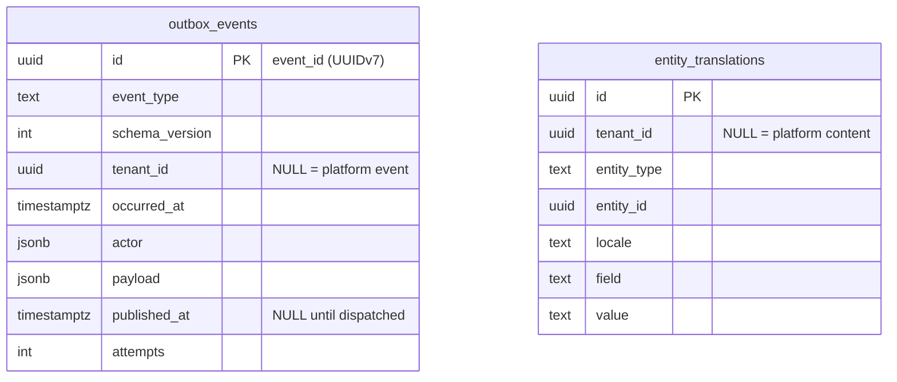

- **outbox_events** — §0.2 outbox. Idempotency key = `id`. Partial index on `created_at WHERE published_at IS NULL` (dispatcher scan) + indexes on `event_type`, `tenant_id`. No RLS (infra table; dispatcher runs as service role).
- **entity_translations** — D8 DB-content translation. Unique `(entity_type, entity_id, locale, field)`. RLS shared-read.

---

## 1. Identity (§1)

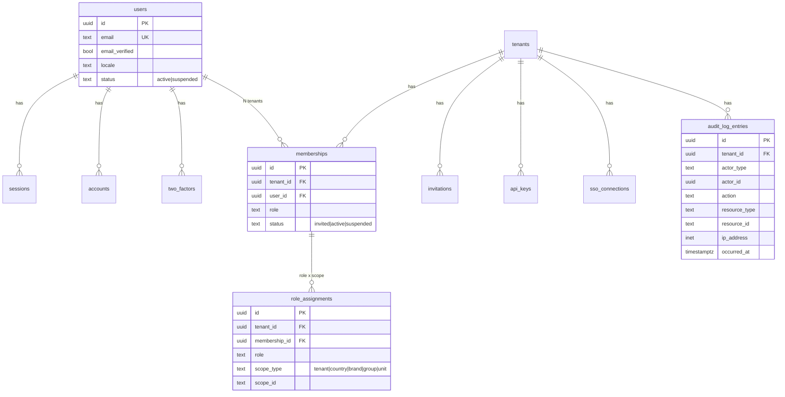

| Table               | Keys / FKs                                                               | Notable                                   | RLS         |
| ------------------- | ------------------------------------------------------------------------ | ----------------------------------------- | ----------- |
| `users`             | PK id; UK email                                                          | global person; locale; status             | auth (none) |
| `sessions`          | FK user_id; UK token                                                     | `active_organization_id` = focused tenant | auth        |
| `accounts`          | FK user_id                                                               | provider credential (password here)       | auth        |
| `verifications`     | idx identifier                                                           | email/reset tokens                        | auth        |
| `two_factors`       | FK user_id; UK user_id                                                   | TOTP + backup codes                       | auth        |
| `memberships`       | FK tenant_id, user_id; UK (tenant_id,user_id)                            | Better Auth "member"                      | auth        |
| `invitations`       | FK tenant_id, inviter_id                                                 | expires 7d                                | auth        |
| `role_assignments`  | FK tenant_id, membership_id; UK (membership_id,role,scope_type,scope_id) | hierarchical RBAC scope                   | isolated    |
| `api_keys`          | FK tenant_id, created_by; UK key_hash                                    | least-privilege permission list           | isolated    |
| `sso_connections`   | FK tenant_id; UK email_domain                                            | SAML/OIDC (phase 2)                       | isolated    |
| `audit_log_entries` | FK tenant_id; idx (tenant,occurred_at),(resource),(actor)                | append-only, D12                          | isolated    |

---

## 2. Tenancy (§2)

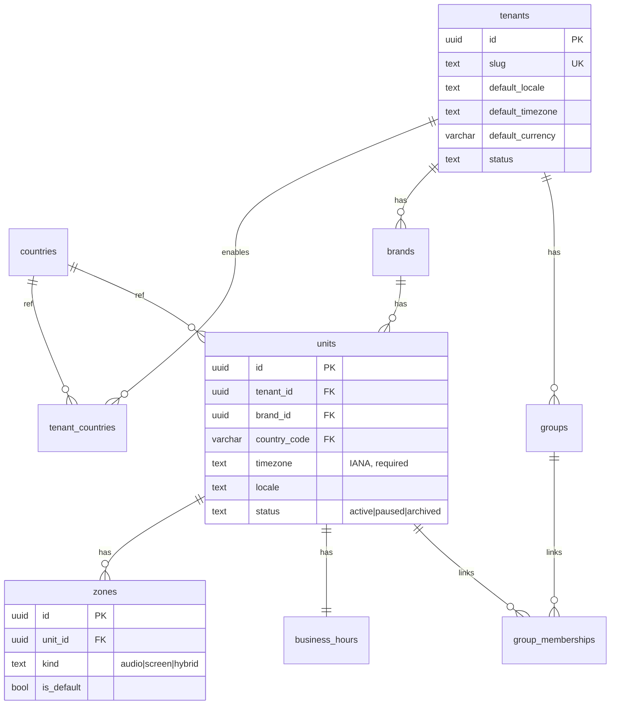

| Table               | Keys / FKs                                                                                | Notable                                        | RLS                    |
| ------------------- | ----------------------------------------------------------------------------------------- | ---------------------------------------------- | ---------------------- |
| `tenants`           | PK id; UK slug                                                                            | defaults (locale/tz/currency); Better Auth org | root (isolated via id) |
| `countries`         | PK code(2)                                                                                | ISO 3166 ref; `names` jsonb; currencies[]      | platform               |
| `tenant_countries`  | FK tenant_id, country_code; UK (tenant,country)                                           | market enablement                              | isolated               |
| `brands`            | FK tenant_id; UK (tenant,slug); idx tenant                                                | brand kit anchor                               | isolated               |
| `groups`            | FK tenant_id; idx tenant                                                                  | free-form transversal grouping                 | isolated               |
| `units`             | FK tenant_id, brand_id, country_code; UK (tenant,external_code); idx tenant/brand/country | atomic execution target; geo                   | isolated               |
| `group_memberships` | FK tenant_id, group_id, unit_id; UK (group,unit)                                          | N:N                                            | isolated               |
| `zones`             | FK tenant_id, unit_id; UK (unit,name)                                                     | execution point; default zone                  | isolated               |
| `business_hours`    | FK tenant_id, unit_id; UK unit                                                            | weekly rules + exceptions (local)              | isolated               |

---

## 3. Fleet (§3)

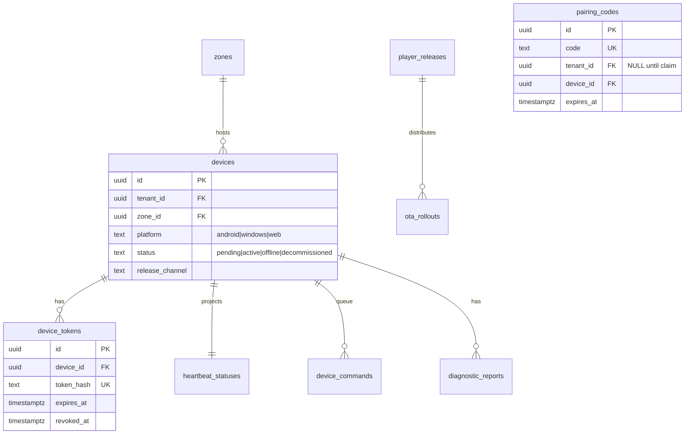

| Table                | Keys / FKs                                                                   | Notable                               | RLS                  |
| -------------------- | ---------------------------------------------------------------------------- | ------------------------------------- | -------------------- |
| `devices`            | FK tenant_id, zone_id; **UK zone_id WHERE status live**; idx (tenant,status) | one live device/zone (§3.9)           | isolated             |
| `pairing_codes`      | FK tenant_id, device_id; UK code; idx expires_at                             | pre-claim, tenant_id NULL until claim | none (exchange-only) |
| `device_tokens`      | FK tenant_id, device_id; UK token_hash                                       | rotating, min scope (D11)             | isolated             |
| `heartbeat_statuses` | PK device_id; FK tenant_id                                                   | hot projection only                   | isolated             |
| `player_releases`    | UK (platform,version)                                                        | Senvori build                         | platform             |
| `ota_rollouts`       | FK release_id; idx status                                                    | gradual + auto-rollback               | platform             |
| `device_commands`    | FK tenant_id, device_id, issued_by; idx (device,status)                      | expiring; desired state via manifest  | isolated             |
| `diagnostic_reports` | FK tenant_id, device_id; idx (device,created_at)                             | on-demand                             | isolated             |

---

## 4. Catalog (§4)

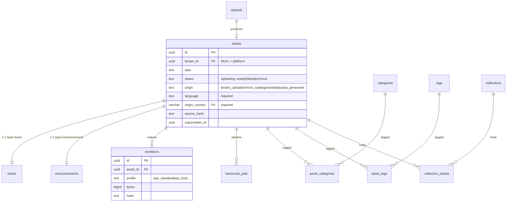

| Table                                                   | Keys / FKs                                                                                  | Notable                                                       | RLS                    |
| ------------------------------------------------------- | ------------------------------------------------------------------------------------------- | ------------------------------------------------------------- | ---------------------- |
| `assets`                                                | FK tenant_id, origin_country, created_by; idx (tenant,type,status),(source_hash),(language) | mandatory global metadata (Principle 6); immutable when ready | shared-read            |
| `tracks`                                                | PK asset_id; idx isrc, artist                                                               | ISRC, BPM, energy 1–5                                         | shared-read            |
| `announcements`                                         | PK asset_id; FK voice_profile_id                                                            | TTS voice ref (§5.9)                                          | shared-read            |
| `uploads`                                               | FK tenant_id, asset_id, created_by; idx (tenant,status)                                     | multipart presigned (R2)                                      | isolated               |
| `transcode_jobs`                                        | FK asset_id; idx (status,created_at),(asset)                                                | FFmpeg queue mirror                                           | shared-read            |
| `renditions`                                            | FK asset_id; UK (asset,profile)                                                             | hash-verified by player                                       | shared-read            |
| `categories`                                            | FK tenant_id; UK (tenant,slug)                                                              | translatable taxonomy                                         | shared-read            |
| `tags`                                                  | FK tenant_id; UK (tenant,name)                                                              | free-form                                                     | isolated               |
| `collections`                                           | FK tenant_id; idx tenant                                                                    | folders                                                       | isolated               |
| `asset_categories` / `asset_tags` / `collection_assets` | composite PK                                                                                | N:N joins                                                     | shared-read / isolated |

---

## 5. Licensing (§5, D10)

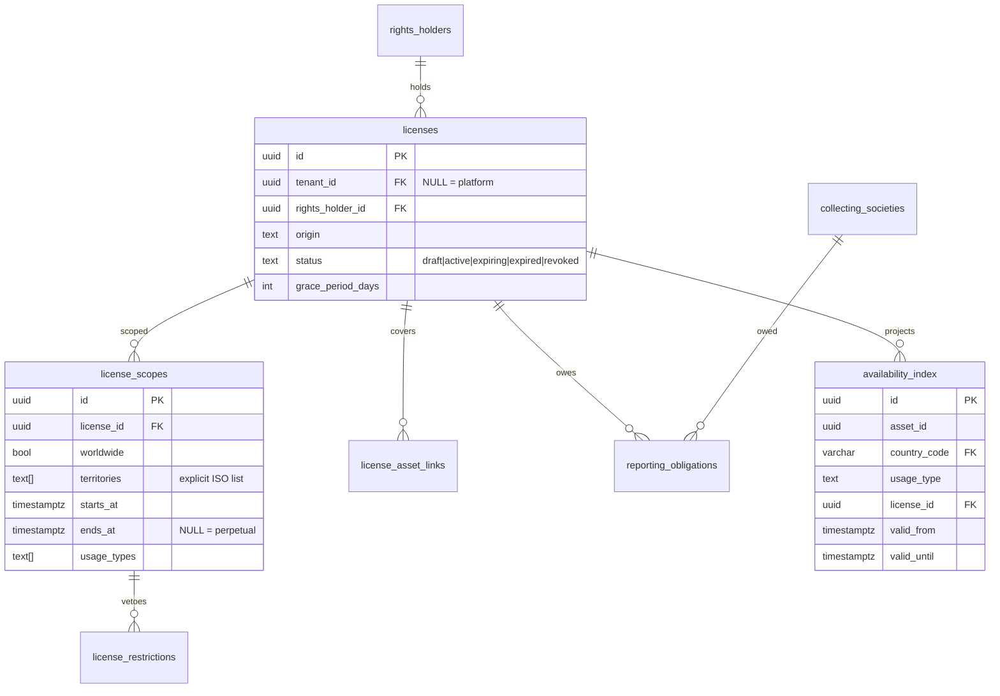

| Table                   | Keys / FKs                                                                               | Notable                                        | RLS         |
| ----------------------- | ---------------------------------------------------------------------------------------- | ---------------------------------------------- | ----------- |
| `rights_holders`        | FK tenant_id, country_code; idx tenant                                                   | label/publisher/tenant/senvori/provider        | shared-read |
| `licenses`              | FK tenant_id, rights_holder_id; idx (tenant,status)                                      | grace period; renewal flag                     | shared-read |
| `license_scopes`        | FK license_id                                                                            | territories explicit or worldwide              | shared-read |
| `license_restrictions`  | FK scope_id                                                                              | restrictions beat scopes                       | shared-read |
| `license_asset_links`   | FK license_id; idx (target_type,target_id)                                               | asset/pack/catalog granularity                 | shared-read |
| `collecting_societies`  | FK country_code; UK (country,name)                                                       | ECAD/ASCAP/SGAE…                               | platform    |
| `reporting_obligations` | FK license_id, society_id; idx next_due_at                                               | RRULE cadence                                  | shared-read |
| `availability_index`    | FK country_code, license_id; UK (asset,country,usage,license); idx (country,usage,asset) | materialized read cache; licenses remain truth | shared-read |

---

## 6. Playlists (§6)

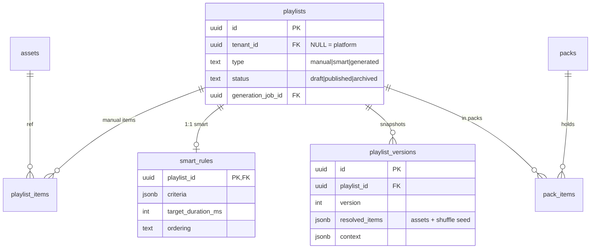

| Table               | Keys / FKs                                                                     | Notable                       | RLS         |
| ------------------- | ------------------------------------------------------------------------------ | ----------------------------- | ----------- |
| `playlists`         | FK tenant_id, owner_id, image_asset_id, generation_job_id; idx (tenant,status) | manual/smart/generated        | shared-read |
| `playlist_items`    | FK playlist_id, asset_id; UK (playlist,position)                               | ordered                       | shared-read |
| `smart_rules`       | PK playlist_id                                                                 | dynamic criteria              | shared-read |
| `rotation_policies` | FK tenant_id; UK tenant                                                        | anti-repetition gaps          | isolated    |
| `packs`             | FK tenant_id, image_asset_id; idx (tenant,status)                              | marketplace unit              | shared-read |
| `pack_items`        | FK pack_id, playlist_id; UK (pack,playlist)                                    | ordered N:N                   | shared-read |
| `playlist_versions` | FK playlist_id; UK (playlist,version)                                          | immutable resolution snapshot | shared-read |

---

## 7. Scheduling (§7)

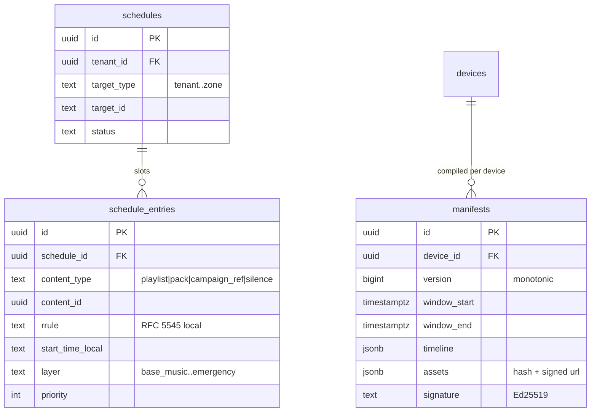

| Table              | Keys / FKs                                               | Notable                           | RLS                                  |
| ------------------ | -------------------------------------------------------- | --------------------------------- | ------------------------------------ |
| `schedules`        | FK tenant_id; idx (tenant,target),(tenant,status)        | bound to hierarchy node           | isolated                             |
| `schedule_entries` | FK schedule_id; idx (schedule),(content)                 | RRULE + layer + priority          | isolated                             |
| `silence_policies` | FK tenant_id; idx (tenant,target)                        | legal quiet hours                 | isolated                             |
| `manifests`        | FK tenant_id, device_id; UK (device,version); idx tenant | signed, immutable, versioned (D6) | isolated                             |
| `compilation_jobs` | idx (status,created_at)                                  | incremental compile queue         | platform-ish (no tenant FK required) |

---

## 8. Campaigns (§8)

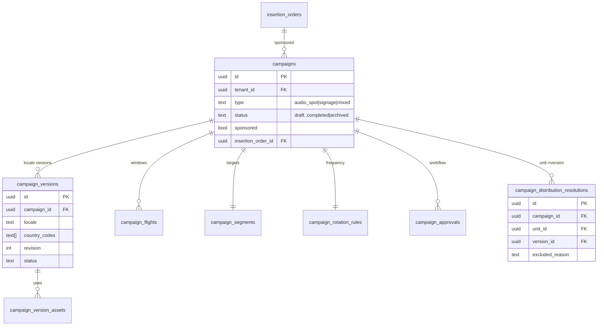

| Table                               | Keys / FKs                                                           | Notable                                      | RLS      |
| ----------------------------------- | -------------------------------------------------------------------- | -------------------------------------------- | -------- |
| `campaigns`                         | FK tenant_id, owner_id, insertion_order_id; idx (tenant,status),(io) | sponsored → Retail Media                     | isolated |
| `campaign_versions`                 | FK campaign_id; UK (campaign,locale,revision)                        | per-locale, immutable when approved          | isolated |
| `campaign_version_assets`           | FK version_id, asset_id; UK (version,asset,role)                     | audio/signage/thumb                          | isolated |
| `campaign_flights`                  | FK campaign_id                                                       | dates in unit-local time                     | isolated |
| `campaign_segments`                 | PK campaign_id                                                       | include/exclude hierarchy; auto-include flag | isolated |
| `campaign_rotation_rules`           | PK campaign_id                                                       | plays/hour, min gap                          | isolated |
| `campaign_approvals`                | FK campaign_id, actor_id                                             | append-only trail                            | isolated |
| `campaign_distribution_resolutions` | FK campaign_id, unit_id, version_id; UK (campaign,unit)              | locale selection / exclusion                 | isolated |

---

## 9. Brand Experience (§9)

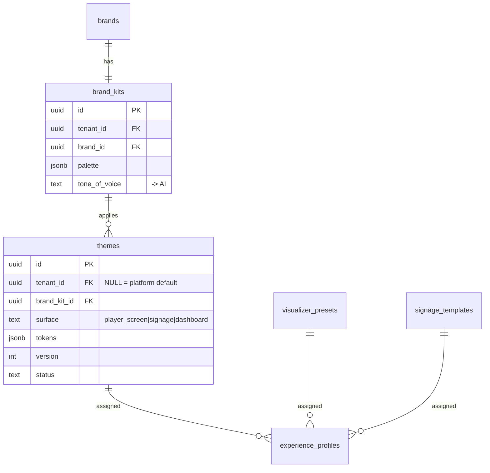

| Table                 | Keys / FKs                                                             | Notable                                | RLS         |
| --------------------- | ---------------------------------------------------------------------- | -------------------------------------- | ----------- |
| `brand_kits`          | FK tenant_id, brand_id; UK brand                                       | logos/palette/type/tone                | isolated    |
| `themes`              | FK brand_kit_id; UK (kit,surface,version); idx tenant                  | versioned, immutable; platform default | shared-read |
| `visualizer_presets`  | FK tenant_id                                                           | capability requirements                | shared-read |
| `motion_packs`        | FK license_id                                                          | platform, licensed                     | platform    |
| `signage_templates`   | FK tenant_id                                                           | typed content zones                    | shared-read |
| `experience_profiles` | FK tenant_id, theme_id, visualizer_id, template_id; UK (tenant,target) | specificity assignment                 | isolated    |

---

## 10. Retail Media (§10)

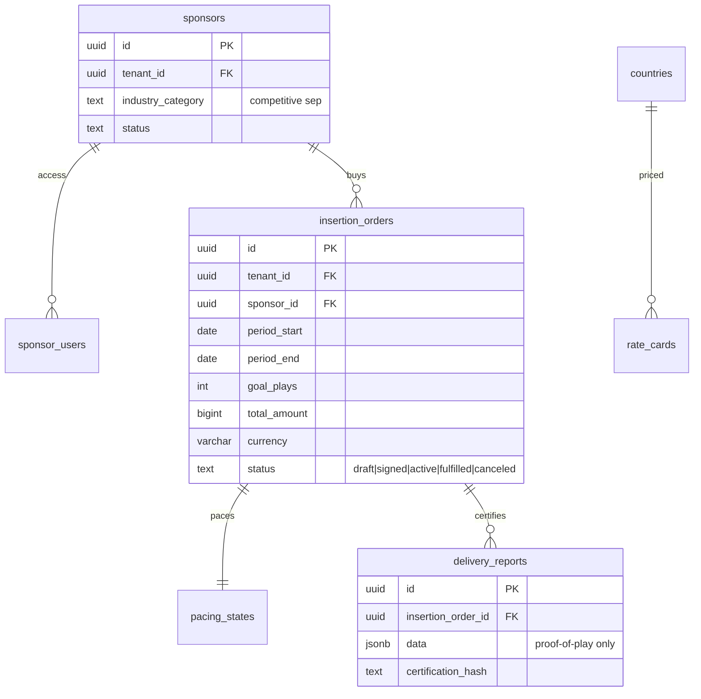

| Table                     | Keys / FKs                                               | Notable                      | RLS      |
| ------------------------- | -------------------------------------------------------- | ---------------------------- | -------- |
| `sponsors`                | FK tenant_id; idx tenant                                 | advertiser                   | isolated |
| `sponsor_users`           | FK tenant_id, sponsor_id, user_id; UK (sponsor,user)     | restricted access            | isolated |
| `inventory_slots`         | FK tenant_id; idx tenant                                 | capacity/hour saturation cap | isolated |
| `rate_cards`              | FK tenant_id, market; UK (tenant,slot_type,market,model) | price list per market (D9)   | isolated |
| `insertion_orders`        | FK tenant_id, sponsor_id; idx (tenant,status),(sponsor)  | the contract; money          | isolated |
| `pacing_states`           | PK insertion_order_id                                    | delivery projection          | isolated |
| `delivery_reports`        | FK insertion_order_id; idx io                            | certified from proof-of-play | isolated |
| `competitive_separations` | FK tenant_id; idx tenant                                 | anti-conflict                | isolated |

---

## 11. Marketplace (§11)

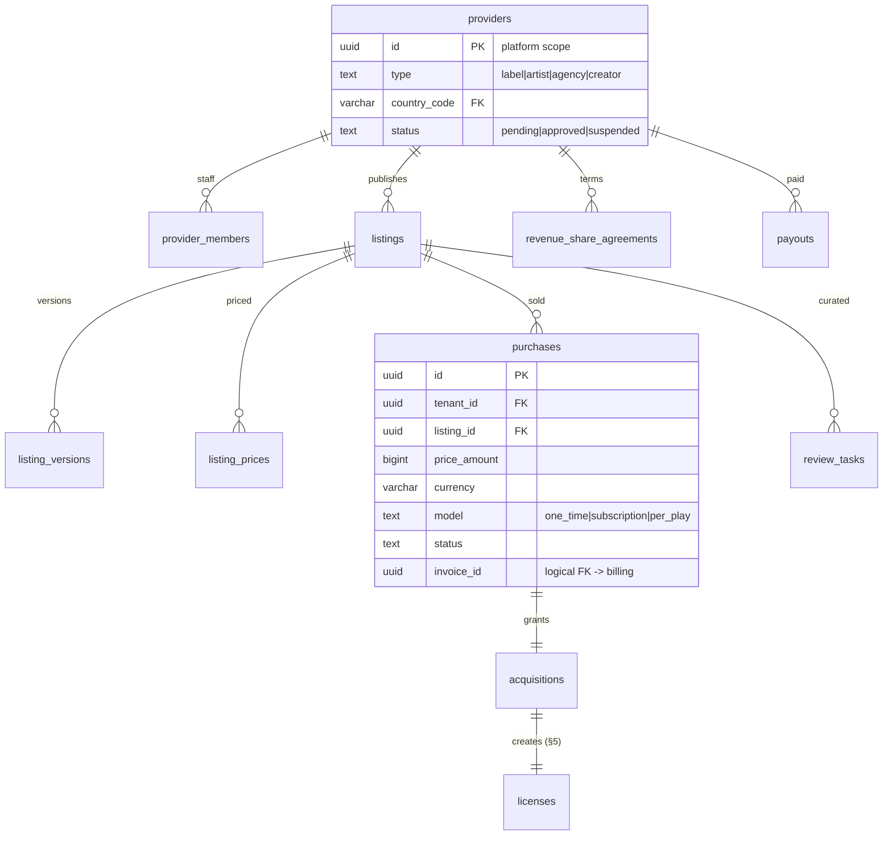

| Table                      | Keys / FKs                                                                  | Notable                             | RLS      |
| -------------------------- | --------------------------------------------------------------------------- | ----------------------------------- | -------- |
| `providers`                | FK country_code; idx status                                                 | seller (not a tenant)               | platform |
| `provider_members`         | FK provider_id, user_id; UK (provider,user)                                 | role `provider`                     | platform |
| `listings`                 | FK provider_id; idx (provider),(status)                                     | territory-scoped offer              | platform |
| `listing_versions`         | FK listing_id; UK (listing,version)                                         | versioned content                   | platform |
| `listing_prices`           | FK listing_id, market; UK (listing,market,model)                            | price list (D9)                     | platform |
| `purchases`                | FK tenant_id, listing_id, listing_version_id; idx (tenant,status),(listing) | frozen price; logical FK invoice_id | isolated |
| `acquisitions`             | FK tenant_id, purchase_id, license_id; UK purchase                          | materializes a License              | isolated |
| `revenue_share_agreements` | FK provider_id; idx (provider,effective_from)                               | rev-share bps                       | platform |
| `payouts`                  | FK provider_id; UK (provider,period); idx status                            | immutable basis; `held` on dispute  | platform |
| `review_tasks`             | FK listing_id, reviewer_id; idx listing                                     | mandatory curation gate             | platform |

---

## 12. Billing (§12, D9)

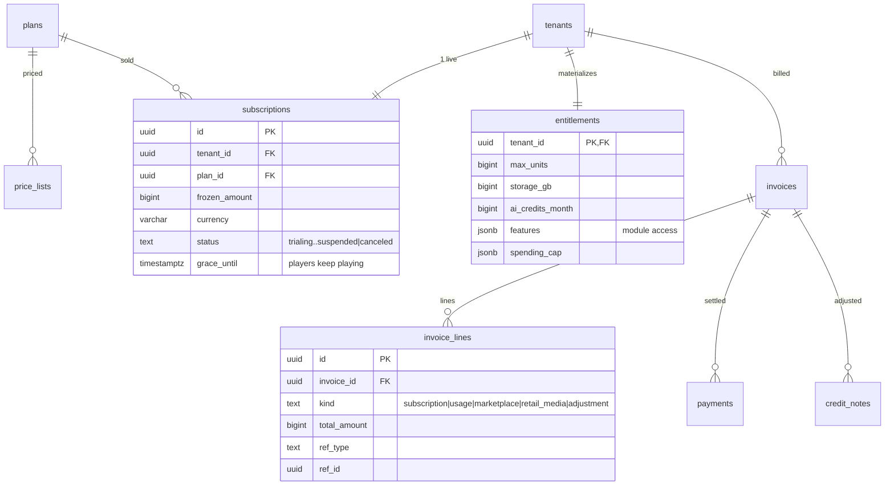

| Table              | Keys / FKs                                                                    | Notable                         | RLS      |
| ------------------ | ----------------------------------------------------------------------------- | ------------------------------- | -------- |
| `plans`            | UK name                                                                       | commercial product              | platform |
| `price_lists`      | FK plan_id, market; UK (plan,market)                                          | per-market price                | platform |
| `subscriptions`    | FK tenant_id, plan_id, price_list_id; **UK tenant_id WHERE status<>canceled** | one live; frozen price; grace   | isolated |
| `entitlements`     | PK tenant_id                                                                  | single limits interface (§12.9) | isolated |
| `usage_records`    | FK tenant_id; idx (tenant,metric,period)                                      | metered consumption             | isolated |
| `invoices`         | FK tenant_id; UK number; idx (tenant,status)                                  | header                          | isolated |
| `invoice_lines`    | FK tenant_id, invoice_id; idx invoice                                         | polymorphic ref_type/ref_id     | isolated |
| `payments`         | FK tenant_id, invoice_id; UK gateway_ref; idx invoice                         | idempotent webhook reconcile    | isolated |
| `payment_methods`  | FK tenant_id; idx tenant                                                      | card/pix/boleto                 | isolated |
| `gateway_accounts` | UK provider                                                                   | vault ref only                  | platform |
| `credit_notes`     | FK tenant_id, invoice_id; idx invoice                                         | refunds/adjustments             | isolated |
| `tax_profiles`     | FK tenant_id, market; UK (tenant,market)                                      | fiscal data                     | isolated |

---

## 13. Analytics (§13, D12)

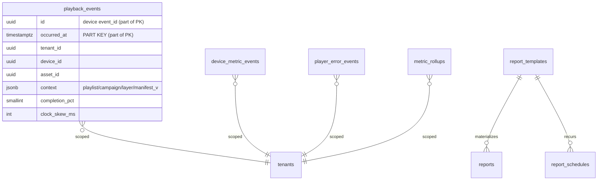

**Event tables** (`playback_events`, `device_metric_events`, `player_error_events`) — composite PK `(id, occurred_at)`, `PARTITION BY RANGE (occurred_at)` monthly + DEFAULT (migration `0002`). Dimension refs are plain UUIDs (no FK) to keep the hot ingestion path cheap and let events survive dimension archival. Idempotency key = device-generated `id`. RLS isolated (FORCEd on parent + partitions).

| Table                  | Keys                                                                | Notable                  | RLS                   |
| ---------------------- | ------------------------------------------------------------------- | ------------------------ | --------------------- |
| `playback_events`      | PK (id,occurred_at); idx (tenant,time),(asset,time),(device,time)   | proof-of-play            | isolated, partitioned |
| `device_metric_events` | PK (id,occurred_at); idx (device,time)                              | heartbeat history        | isolated, partitioned |
| `player_error_events`  | PK (id,occurred_at); idx (kind,time)                                | OTA failure rates        | isolated, partitioned |
| `ingestion_batches`    | FK tenant_id; idx (device,created_at)                               | dedup bookkeeping        | isolated              |
| `metric_rollups`       | FK tenant_id; UK (tenant,metric,granularity,period,dimensions_hash) | permanent aggregations   | isolated              |
| `report_templates`     | FK tenant_id                                                        | platform + tenant        | shared-read           |
| `reports`              | FK tenant_id, template_id, created_by; idx (tenant,status)          | immutable when submitted | isolated              |
| `report_schedules`     | FK tenant_id, template_id; idx tenant                               | RRULE cadence            | isolated              |
| `saved_views`          | FK tenant_id, user_id; idx user                                     | per-user dashboards      | isolated              |
| `exports`              | FK tenant_id, user_id; idx (tenant,created_at)                      | audited exports          | isolated              |

---

## 14. AI (§14)

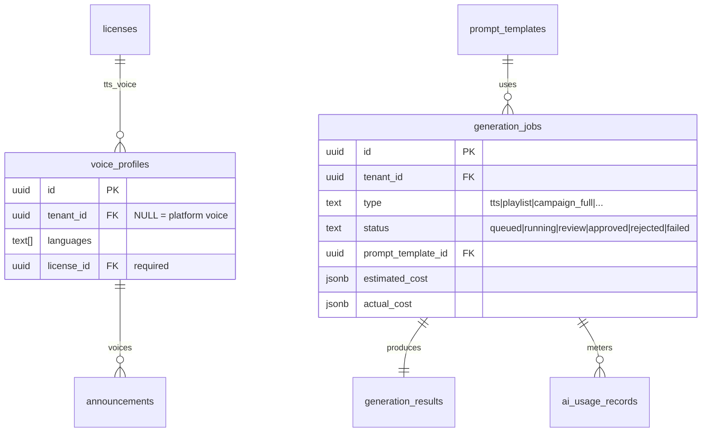

| Table                | Keys / FKs                                                                       | Notable                               | RLS         |
| -------------------- | -------------------------------------------------------------------------------- | ------------------------------------- | ----------- |
| `ai_adapters`        | UK (capability,provider)                                                         | pluggable gateway                     | platform    |
| `voice_profiles`     | FK tenant_id, license_id; idx tenant                                             | voice is licensable                   | shared-read |
| `prompt_templates`   | UK (use_case,version)                                                            | versioned                             | platform    |
| `generation_jobs`    | FK tenant_id, prompt_template_id, requested_by, reviewed_by; idx (tenant,status) | cost metered; human approval          | isolated    |
| `generation_results` | FK tenant_id, job_id; idx job                                                    | artifacts + mandatory rationale       | isolated    |
| `automation_rules`   | FK tenant_id, prompt_template_id; idx tenant                                     | phase-2 triggers                      | isolated    |
| `ai_usage_records`   | FK tenant_id, job_id; idx (tenant,created_at)                                    | → Billing usage                       | isolated    |
| `content_policies`   | FK tenant_id; UK tenant                                                          | platform inviolable + tenant-restrict | shared-read |

---

## Cross-domain relationships (logical FKs)

To keep the module import graph acyclic (D2), a few references are **logical FKs** — real
UUID columns without a DB-level `REFERENCES`, validated by the owning domain's public interface:

| From                  | Column                            | To                            | Why not a hard FK                        |
| --------------------- | --------------------------------- | ----------------------------- | ---------------------------------------- |
| `rights_holders`      | `provider_id`                     | `marketplace.providers`       | licensing ← marketplace would cycle      |
| `purchases`           | `invoice_id`                      | `billing.invoices`            | marketplace ← billing would cycle        |
| `schedule_entries`    | `content_id`                      | playlists / packs / campaigns | polymorphic target                       |
| `license_asset_links` | `target_id`                       | assets / packs / catalog      | polymorphic target                       |
| `invoice_lines`       | `ref_id`                          | purchases / insertion_orders  | polymorphic source                       |
| `availability_index`  | `asset_id`                        | `catalog.assets`              | read-model projection, survives archival |
| analytics `*_events`  | `device_id`,`asset_id`,`unit_id`… | fleet / catalog / tenancy     | hot path, survive dimension archival     |

**Hard FK dependency order** (create order): `countries` → `tenants` → `users`/identity →
`brands`/`groups`/`units`/`zones` → `licenses`/`voice_profiles` → `assets` → `playlists`/`packs`
→ `devices` → `schedules`/`manifests` → `campaigns` (← `insertion_orders`) → billing/analytics.

## Verification (this migration set, on PostgreSQL 16)

- 139 public tables; 95 with RLS enabled; **95 FORCE RLS**; 122 policies; 20 monthly event partitions provisioned.
- Cross-tenant write **rejected** by policy; per-tenant reads isolated; empty context returns nothing (NULLIF guard, no cast error).
- Shared-read: platform asset (`tenant_id NULL`) visible from any tenant; tenant assets isolated.
- Event insert routes to the correct monthly partition (`playback_events_2026_07`); audit + `archived_at` present.
- `drizzle-kit generate` reports **no schema changes** — schema and migrations are in sync.
