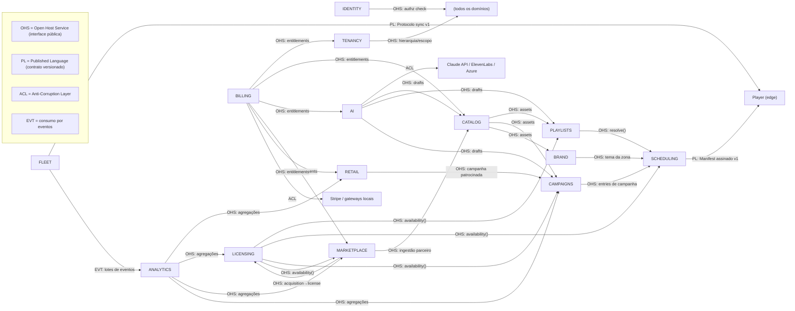
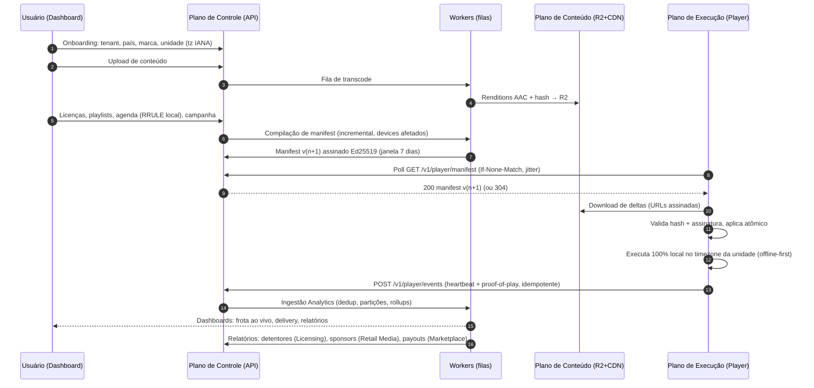

# SENVORI CORE DOMAINS

Versão 1.0 | Julho 2026 | Documento vivo

Este documento é o cérebro da Senvori. Ele define todos os domínios centrais da plataforma antes de qualquer linha de código, schema ou tela. É o terceiro documento da fundação, e depende dos dois anteriores:

1. **Princípios Fundadores** (`PRINCIPIOS_FUNDADORES.md`) — o porquê.
2. **Arquitetura e Stack de Referência** (`ARQUITETURA_E_STACK.md`) — o como técnico (decisões D1–D12).
3. **Core Domains** (este documento) — o quê: domínios, entidades, regras, fluxos, eventos, APIs e permissões.

Regra de leitura: nada aqui é implementação. Tudo aqui é contrato. Banco de dados, Drizzle schemas, APIs, dashboard e player só podem ser iniciados depois que este documento estiver aprovado — e devem obedecê-lo.

---

## Índice

- [0. Convenções transversais](#0-convenções-transversais)
- [1. Identity](#1-identity)
- [2. Tenancy](#2-tenancy)
- [3. Fleet](#3-fleet)
- [4. Catalog](#4-catalog)
- [5. Licensing](#5-licensing)
- [6. Playlists](#6-playlists)
- [7. Scheduling](#7-scheduling)
- [8. Campaigns](#8-campaigns)
- [9. Brand Experience](#9-brand-experience)
- [10. Retail Media](#10-retail-media)
- [11. Marketplace](#11-marketplace)
- [12. Billing](#12-billing)
- [13. Analytics](#13-analytics)
- [14. AI](#14-ai)
- [15. Domain Map](#15-domain-map)
- [16. Bounded Context Map](#16-bounded-context-map)
- [17. Event Storming](#17-event-storming)
- [18. Fluxo completo do sistema](#18-fluxo-completo-do-sistema)
- [19. Dependências entre módulos](#19-dependências-entre-módulos)
- [20. Critério de conclusão e próxima etapa](#20-critério-de-conclusão-e-próxima-etapa)

---

## 0. Convenções transversais

Estas convenções valem para todos os domínios. Nenhum domínio pode violá-las.

### 0.1 Identidade de dados

- Toda entidade tem `id` UUIDv7 (ordenável por tempo, índice eficiente).
- Toda tabela de negócio carrega `tenant_id` com Row Level Security ativa (D3). Exceções explícitas: entidades de plataforma (países ISO, planos, releases de player, providers de marketplace) vivem em escopo global e são marcadas como tal na seção do domínio.
- Timestamps sempre `timestamptz` em UTC (`created_at`, `updated_at`). Horário de parede local só existe em regras de agendamento (D4).
- Exclusão é soft delete (`archived_at`) para entidades de negócio; hard delete só por rotina de retenção/compliance (LGPD/GDPR).
- Campos traduzíveis de banco usam a tabela de tradução por entidade (`entity_id`, `locale`, `field`, `value`) com fallback em cadeia: locale do usuário → locale da unidade → locale do tenant → EN (D8).

### 0.2 Eventos de sistema

- Naming: `dominio.entidade.acao`, ação sempre no passado (`catalog.asset.transcoded`). Eventos são fatos, não comandos.
- Envelope padrão de todo evento:

```json
{
  "event_id": "uuid v7",
  "event_type": "catalog.asset.transcoded",
  "schema_version": 1,
  "tenant_id": "uuid | null (eventos de plataforma)",
  "occurred_at": "UTC timestamptz",
  "actor": { "type": "user | device | system | api_key", "id": "uuid" },
  "payload": {}
}
```

- Publicação via **outbox pattern**: o evento é gravado na mesma transação da mudança de estado e despachado por um worker (Redis + BullMQ no MVP). Nunca publicar direto do handler HTTP.
- Consumo idempotente por `event_id` em todos os consumidores.
- Comunicação entre módulos: **nunca** import de código interno (D2). Apenas interface pública do módulo (chamada síncrona quando precisa de resposta) ou evento (quando é notificação de fato).

### 0.3 APIs REST

- Prefixo `/v1`, recursos no plural, kebab-case (`/v1/insertion-orders`).
- Autenticação: sessão/token de usuário (Better Auth), API key de integração ou device token — cada um com escopo próprio. `tenant_id` vem do contexto de autenticação, nunca de parâmetro do cliente.
- Paginação por cursor (`?cursor=&limit=`), ordenação estável por `id`.
- Toda mutação `POST` aceita `Idempotency-Key`.
- Erros: problem details (`application/problem+json`) com código estável por domínio (`LICENSING_TERRITORY_DENIED`).
- Contratos definidos em Zod no pacote `packages/contracts` e publicados como OpenAPI (D1). Este documento lista rotas e semântica; o contrato fino nasce na fase de APIs.
- Superfícies separadas: **Dashboard API** (usuários), **Player API** (`/v1/player/*`, só device token), **Partner API** (providers do marketplace e sponsors, fase 2), **Webhooks** (entrada de gateways).

### 0.4 Permissões

- Formato: `dominio:recurso:acao` (ex.: `catalog:asset:upload`).
- Toda permissão é avaliada contra um **escopo hierárquico** (D11): `tenant → país → marca → grupo → unidade`. Um papel atribuído em um nó vale para todo o subárvore daquele nó.
- Papéis do sistema (imutáveis, cobrem o MVP):

| Papel              | Descrição resumida                                                           |
| ------------------ | ---------------------------------------------------------------------------- |
| `owner`            | Dono do tenant. Tudo, inclusive billing e exclusão do tenant.                |
| `admin`            | Administra tudo exceto encerrar tenant e trocar owner.                       |
| `manager`          | Operação de um escopo (país/marca/grupo/unidade): frota, agenda, campanhas.  |
| `curator`          | Catálogo, playlists e packs. Não publica agenda.                             |
| `campaign_manager` | Cria e edita campanhas; publica se tiver `campaigns:campaign:approve`.       |
| `finance`          | Billing, faturas, relatórios financeiros.                                    |
| `analyst`          | Somente leitura de analytics e relatórios.                                   |
| `unit_operator`    | Pairing de devices e operação local da própria unidade.                      |
| `rights_manager`   | Licenças e relatórios de direitos.                                           |
| `provider`         | Participante do marketplace (escopo: seu provider, não o tenant).            |
| `sponsor`          | Anunciante de retail media (escopo: suas campanhas e relatórios).            |
| `support`          | Papel interno Senvori: leitura + impersonação com consentimento e audit log. |

- Papéis custom por tenant: fase 2. O modelo (papel = conjunto de permissões) já nasce pronto para isso.

### 0.5 Realtime

- **Dashboard**: canal WebSocket/SSE por tenant com tópicos por domínio (`fleet.device.online`). É projeção dos eventos de sistema — nenhuma lógica de negócio no canal.
- **Player**: MVP é polling do manifest com `ETag` (D6). Fase 2 adiciona MQTT para push de comandos e invalidação; o polling permanece como rede de segurança. Quando este documento diz "evento realtime para o player", leia: _bump de versão do manifest hoje, push MQTT amanhã_.

### 0.6 Dinheiro, tempo e idioma

- Dinheiro: inteiro em unidade mínima + código ISO 4217, price list por mercado, nunca conversão automática (D9).
- Tempo: persistência UTC, regras em horário de parede local com RRULE (RFC 5545), política DST explícita (D4).
- Idioma: zero texto hardcoded, ICU MessageFormat, conteúdo de banco com tabela de tradução (D8).

---

## 1. Identity

### 1.1 Objetivo

Responder, para cada requisição, três perguntas: **quem é você** (autenticação), **o que você pode fazer** (autorização) e **onde você pode fazer** (escopo). Gerencia humanos e credenciais de integração. Não gerencia identidade de dispositivos — isso é do Fleet (D11: dispositivo nunca usa credencial de usuário).

Implementação de referência: Better Auth self-hosted com plugin de organizações (D11). O domínio define o modelo; o Better Auth é detalhe de infraestrutura atrás da interface pública do módulo.

### 1.2 Entidades

| Entidade         | Escopo        | Descrição                                                                                                  | Atributos-chave                                                                    |
| ---------------- | ------------- | ---------------------------------------------------------------------------------------------------------- | ---------------------------------------------------------------------------------- |
| `User`           | Global        | Pessoa física. Existe fora de qualquer tenant (uma agência acessa vários tenants).                         | email único global, nome, locale próprio, status                                   |
| `Credential`     | Global        | Meio de autenticação do usuário.                                                                           | tipo (password, oauth, passkey), dados do provedor                                 |
| `MfaFactor`      | Global        | Segundo fator.                                                                                             | tipo (totp, recovery_codes), status, verified_at                                   |
| `Session`        | Global        | Sessão ativa.                                                                                              | user_id, expiração, device info, ip                                                |
| `Membership`     | Tenant        | Vínculo usuário ↔ tenant.                                                                                  | user_id, tenant_id, status (invited, active, suspended)                            |
| `Invitation`     | Tenant        | Convite pendente.                                                                                          | email, papel proposto, escopo proposto, expira em 7 dias                           |
| `Role`           | Global/Tenant | Conjunto nomeado de permissões. Papéis de sistema são globais e imutáveis; custom (fase 2) são por tenant. | nome, permissões[]                                                                 |
| `Permission`     | Global        | Ação atômica `dominio:recurso:acao`. Catálogo fixo, versionado em código.                                  | chave, descrição                                                                   |
| `RoleAssignment` | Tenant        | Papel × membership × escopo hierárquico.                                                                   | membership_id, role_id, scope_type (tenant, country, brand, group, unit), scope_id |
| `ApiKey`         | Tenant        | Credencial de integração servidor-a-servidor.                                                              | nome, hash, permissões restritas, expiração, last_used_at                          |
| `SsoConnection`  | Tenant        | Conexão SAML/OIDC (fase 2, via WorkOS).                                                                    | provedor, domínio de e-mail, mapeamento de papéis                                  |
| `AuditLogEntry`  | Tenant        | Registro imutável de ação administrativa (D12, compliance).                                                | actor, ação, recurso, escopo, before/after resumido, ip, occurred_at               |

### 1.3 Relacionamentos

- `User` 1:N `Credential`, `MfaFactor`, `Session`.
- `User` N:N `Tenant` através de `Membership` — um usuário pode operar múltiplos tenants com papéis distintos em cada um.
- `Membership` 1:N `RoleAssignment`; cada assignment aponta para um nó da hierarquia do Tenancy (`scope_type` + `scope_id`).
- `Role` N:N `Permission` (materializado no papel).
- `AuditLogEntry` referencia qualquer recurso de qualquer domínio de forma polimórfica (`resource_type`, `resource_id`) — Identity é o dono do audit log porque a pergunta que ele responde é "quem fez".

### 1.4 Casos de uso

1. **Signup + primeiro tenant**: usuário cria conta, verifica e-mail, cria tenant (dispara Tenancy), recebe `owner`.
2. **Convite**: admin convida por e-mail com papel + escopo; aceite cria `Membership` + `RoleAssignment`; convite expira em 7 dias.
3. **Login**: senha ou OAuth; MFA quando habilitado; sessão criada com expiração.
4. **MFA enroll**: usuário ativa TOTP; tenant pode tornar MFA obrigatório para todos os membros.
5. **Gestão de papéis**: admin atribui/revoga papéis com escopo; mudança propaga em tempo real (sessões recarregam permissões).
6. **API keys**: admin cria chave com subconjunto de permissões e expiração; rotação sem downtime (duas chaves ativas durante a troca).
7. **SSO enterprise (fase 2)**: tenant conecta IdP; usuários do domínio autenticam via SAML/OIDC; papéis mapeados por grupo do IdP.
8. **Impersonação de suporte**: papel `support` assume visão do usuário mediante consentimento registrado; toda a sessão impersonada é audit-logada.
9. **Offboarding**: suspensão de membership revoga sessões e assignments imediatamente; usuário global permanece (outros tenants).
10. **Trilha de auditoria**: qualquer ação administrativa consultável por período, ator, recurso.

### 1.5 Eventos de sistema

| Evento                                                      | Gatilho                  | Consumidores típicos                       |
| ----------------------------------------------------------- | ------------------------ | ------------------------------------------ |
| `identity.user.registered`                                  | Conta criada             | Tenancy (onboarding), Analytics            |
| `identity.invitation.sent` / `identity.invitation.accepted` | Convite                  | Notificações                               |
| `identity.membership.suspended`                             | Offboarding              | Todos (revogação de acesso)                |
| `identity.role.assigned` / `identity.role.revoked`          | Mudança de papel         | Realtime dashboard (refresh de permissões) |
| `identity.mfa.enabled` / `identity.mfa.disabled`            | MFA                      | Audit                                      |
| `identity.session.revoked`                                  | Logout forçado           | Realtime dashboard (força logout)          |
| `identity.apikey.created` / `identity.apikey.revoked`       | Integrações              | Audit                                      |
| `identity.audit.recorded`                                   | Toda ação administrativa | Analytics (fase 2: anomalia)               |

### 1.6 APIs REST

| Método | Rota                        | Descrição                                                                    | Permissão                |
| ------ | --------------------------- | ---------------------------------------------------------------------------- | ------------------------ |
| —      | `/v1/auth/*`                | Fluxos de autenticação (delegados ao Better Auth: login, logout, OAuth, MFA) | pública/sessão           |
| GET    | `/v1/me`                    | Perfil, memberships, permissões efetivas por escopo                          | sessão                   |
| PATCH  | `/v1/me`                    | Locale, nome, preferências                                                   | sessão                   |
| GET    | `/v1/members`               | Membros do tenant com papéis e escopos                                       | `identity:member:read`   |
| POST   | `/v1/invitations`           | Convidar com papel + escopo                                                  | `identity:member:invite` |
| DELETE | `/v1/members/{id}`          | Suspender membership                                                         | `identity:member:manage` |
| GET    | `/v1/roles`                 | Papéis disponíveis e suas permissões                                         | `identity:member:read`   |
| POST   | `/v1/role-assignments`      | Atribuir papel com escopo                                                    | `identity:role:assign`   |
| DELETE | `/v1/role-assignments/{id}` | Revogar                                                                      | `identity:role:assign`   |
| POST   | `/v1/api-keys`              | Criar chave de integração                                                    | `identity:apikey:manage` |
| GET    | `/v1/audit-logs`            | Trilha de auditoria filtrável                                                | `identity:audit:read`    |

### 1.7 Eventos realtime

- `identity.session.revoked` → força logout do dashboard.
- `identity.role.assigned/revoked` → cliente recarrega permissões sem relogin.

### 1.8 Permissões

`identity:member:read`, `identity:member:invite`, `identity:member:manage`, `identity:role:assign`, `identity:apikey:manage`, `identity:audit:read`, `identity:sso:manage` (fase 2).

### 1.9 Regras de negócio

1. E-mail é único globalmente; um `User` participa de N tenants por `Membership`.
2. Papéis de sistema são imutáveis; nenhum tenant edita permissões de papel de sistema.
3. Todo `RoleAssignment` tem escopo explícito; não existe papel "solto". O default de convite é escopo tenant.
4. Autorização é sempre `permissão ∧ escopo`: ter `fleet:device:command` na marca X não permite comandar devices da marca Y.
5. MFA obrigatório é política por tenant; ao ativar, membros sem MFA são forçados a enrolar no próximo login.
6. Dispositivos nunca autenticam por este domínio (D11) — tokens de device são do Fleet.
7. Toda ação administrativa (criar, editar, publicar, revogar — em qualquer domínio) grava `AuditLogEntry` síncrono na mesma transação.
8. Suspensão de membership tem efeito imediato: sessões revogadas, API keys do usuário desativadas.
9. Impersonação exige consentimento do usuário-alvo ou flag contratual do tenant, e é integralmente logada.
10. Least privilege por padrão: convites sugerem o menor papel que cumpre a tarefa.

### 1.10 Futuras expansões

- SSO enterprise SAML/OIDC via WorkOS (fase 2, quando a primeira grande rede exigir — D11).
- SCIM para provisionamento automático de usuários.
- Papéis customizados por tenant e permissões condicionais (ex.: janela de horário).
- Passkeys como método primário.
- Detecção de anomalia de acesso (login impossível, escalada incomum) sobre o audit log.

---

## 2. Tenancy

### 2.1 Objetivo

Ser a fonte única de verdade da **estrutura organizacional**: tenant, países de operação, marcas, grupos e unidades — e dos defaults que descem em cascata (idioma, timezone, moeda). Todos os outros domínios apontam para nós desta hierarquia para escopo, segmentação e execução. É a materialização dos Princípios 1, 3 e 4.

### 2.2 Entidades

| Entidade          | Escopo     | Descrição                                                                                                               | Atributos-chave                                                                                                       |
| ----------------- | ---------- | ----------------------------------------------------------------------------------------------------------------------- | --------------------------------------------------------------------------------------------------------------------- |
| `Tenant`          | Global     | O cliente da Senvori (rede, franquia, holding).                                                                         | nome, slug, locale padrão, timezone padrão, moeda padrão, status, plano (ref Billing)                                 |
| `Country`         | Plataforma | Referência ISO 3166-1 imutável, mantida pela Senvori.                                                                   | código ISO, nomes por locale, moedas usuais, sociedades de gestão (ref Licensing)                                     |
| `TenantCountry`   | Tenant     | País habilitado para o tenant (mercado de operação).                                                                    | country_code, locale padrão do mercado, moeda de cobrança (ref Billing), status                                       |
| `Brand`           | Tenant     | Marca/bandeira operada pelo tenant.                                                                                     | nome, slug, brand kit (ref Brand Experience), locale padrão                                                           |
| `Group`           | Tenant     | Agrupamento flexível e transversal de unidades (região, franqueado, cluster de teste, "lojas premium").                 | nome, tipo livre (tag), descrição                                                                                     |
| `GroupMembership` | Tenant     | Vínculo N:N unidade ↔ grupo.                                                                                            | unit_id, group_id                                                                                                     |
| `Unit`            | Tenant     | A loja/local físico. Átomo de execução da plataforma.                                                                   | nome, código externo, brand_id, country_code, timezone IANA, locale, endereço, geo, status (active, paused, archived) |
| `Zone`            | Tenant     | Ponto de execução dentro da unidade: "som ambiente", "vitrine", "TV do caixa". Toda unidade nasce com uma zona default. | unit_id, nome, tipo (audio, screen, hybrid)                                                                           |
| `BusinessHours`   | Tenant     | Horário de funcionamento da unidade, com exceções (feriados, eventos).                                                  | unit_id, regras semanais em horário local, exceções datadas                                                           |

### 2.3 Relacionamentos

```
Tenant 1:N TenantCountry (países habilitados)
Tenant 1:N Brand
Tenant 1:N Group
Brand  1:N Unit
Unit   N:1 TenantCountry (país da unidade deve estar habilitado)
Unit   N:N Group (via GroupMembership)
Unit   1:N Zone
Unit   1:1 BusinessHours
```

- A hierarquia canônica de escopo (usada por Identity, Scheduling, Campaigns) é: `tenant → país → marca → grupo → unidade → zona`. País, marca e grupo são dimensões paralelas de segmentação; a resolução de conflitos entre elas é regra do Scheduling (especificidade).
- Devices (Fleet) apontam para `Zone`; agenda e campanhas apontam para qualquer nó.

### 2.4 Casos de uso

1. **Criar tenant** (onboarding pós-signup): define locale/timezone/moeda padrão, habilita primeiro país, cria primeira marca.
2. **Habilitar novo país**: destrava unidades naquele país; valida com Billing (price list do mercado) e Licensing (disponibilidade de conteúdo no território).
3. **Criar marca**: com brand kit próprio (Brand Experience).
4. **Criar unidade**: exige marca + país habilitado + timezone IANA; cria zona default e business hours default; dispara sugestão de pairing (Fleet).
5. **Organizar grupos**: criar grupos livres, mover unidades entre grupos em massa.
6. **Alterar timezone/locale de unidade**: caso crítico — invalida manifests compilados (evento consumido pelo Scheduling).
7. **Pausar/arquivar unidade**: pausa entrega de conteúdo (Scheduling), mantém histórico (Analytics), libera device (Fleet).
8. **Importação em massa**: CSV de unidades para redes grandes (fase 2 na UI; a API já nasce em lote).

### 2.5 Eventos de sistema

| Evento                                                    | Gatilho                                 | Consumidores típicos                                    |
| --------------------------------------------------------- | --------------------------------------- | ------------------------------------------------------- |
| `tenancy.tenant.created`                                  | Onboarding                              | Billing (trial), Brand Experience (tema default)        |
| `tenancy.tenant.suspended` / `tenancy.tenant.reactivated` | Billing (inadimplência) ou ação Senvori | Todos os domínios (soft block)                          |
| `tenancy.country.enabled`                                 | Novo mercado                            | Licensing, Billing, Marketplace                         |
| `tenancy.brand.created` / `tenancy.brand.updated`         | Gestão de marcas                        | Brand Experience                                        |
| `tenancy.unit.created`                                    | Nova loja                               | Fleet (pairing), Scheduling (agenda default), Analytics |
| `tenancy.unit.updated`                                    | Dados gerais                            | —                                                       |
| `tenancy.unit.timezone_changed`                           | Correção de timezone                    | **Scheduling (recompila manifest)**                     |
| `tenancy.unit.locale_changed`                             | Correção de locale                      | Campaigns (redistribui versão)                          |
| `tenancy.unit.paused` / `tenancy.unit.archived`           | Ciclo de vida                           | Scheduling, Fleet, Billing (contagem de unidades)       |
| `tenancy.group.membership_changed`                        | Reorganização                           | Scheduling, Campaigns (re-resolver segmentos)           |

### 2.6 APIs REST

| Método                | Rota                                | Descrição                                                    | Permissão                |
| --------------------- | ----------------------------------- | ------------------------------------------------------------ | ------------------------ |
| GET/PATCH             | `/v1/tenant`                        | Dados e defaults do tenant                                   | `tenancy:tenant:manage`  |
| GET                   | `/v1/countries`                     | Referência global de países                                  | sessão                   |
| GET/POST              | `/v1/tenant/countries`              | Países habilitados / habilitar mercado                       | `tenancy:country:manage` |
| GET/POST/PATCH        | `/v1/brands`, `/v1/brands/{id}`     | Marcas                                                       | `tenancy:brand:manage`   |
| GET/POST/PATCH/DELETE | `/v1/groups`, `/v1/groups/{id}`     | Grupos                                                       | `tenancy:group:manage`   |
| PUT                   | `/v1/groups/{id}/units`             | Definir unidades do grupo (lote)                             | `tenancy:group:manage`   |
| GET/POST              | `/v1/units`                         | Listar (filtros: país, marca, grupo, status) / criar em lote | `tenancy:unit:create`    |
| GET/PATCH             | `/v1/units/{id}`                    | Detalhe / editar (timezone, locale, endereço)                | `tenancy:unit:update`    |
| POST                  | `/v1/units/{id}/pause` · `/archive` | Ciclo de vida                                                | `tenancy:unit:manage`    |
| GET/POST/PATCH        | `/v1/units/{id}/zones`              | Zonas da unidade                                             | `tenancy:unit:update`    |
| GET/PUT               | `/v1/units/{id}/business-hours`     | Horário de funcionamento                                     | `tenancy:unit:update`    |

### 2.7 Eventos realtime

- `tenancy.unit.created/paused/archived` → atualização de listas e mapas no dashboard.
- Contadores de unidades por status para o overview da frota (combinado com Fleet).

### 2.8 Permissões

`tenancy:tenant:manage`, `tenancy:country:manage`, `tenancy:brand:manage`, `tenancy:group:manage`, `tenancy:unit:create`, `tenancy:unit:read`, `tenancy:unit:update`, `tenancy:unit:manage` (pausar/arquivar). Todas avaliadas com escopo hierárquico.

### 2.9 Regras de negócio

1. Toda unidade tem exatamente: 1 marca, 1 país (habilitado no tenant), 1 timezone IANA válido, 1 locale. Sem defaults implícitos de país/timezone (Princípio 1).
2. Grupo é transversal e N:N — nunca é usado como hierarquia rígida; é dimensão de segmentação.
3. Cadeia de fallback de locale: usuário → unidade → tenant → EN (D8). Cadeia de fallback de configuração operacional: unidade → marca → tenant.
4. Mudança de timezone de unidade **sempre** invalida manifests da unidade; nunca aplicar silenciosamente (o efeito no chão de loja é imediato).
5. País só pode ser desabilitado sem unidades ativas nele.
6. Unidade arquivada não recebe manifest, não conta para billing, mantém histórico de analytics.
7. Zona default não pode ser removida; devices sempre apontam para uma zona.
8. `Country` é referência de plataforma imutável por tenants; dados regulatórios (sociedades de gestão) são mantidos pela Senvori.
9. Limite de unidades ativas vem do entitlement do plano (Billing) e é verificado na criação/reativação.
10. RLS: absolutamente toda query de outros domínios enxerga apenas o `tenant_id` da sessão (D3).

### 2.10 Futuras expansões

- Tenant pai/holding com consolidação multi-tenant (grandes grupos internacionais).
- Herança de configuração com override explícito por nível (tenant → marca → unidade) para políticas operacionais.
- Importador visual em massa com validação de timezone/geo.
- Residência de dados por região (fase 2 — D: segurança/compliance).

---

## 3. Fleet

### 3.1 Objetivo

Gerenciar o ciclo de vida completo de **dispositivos e players** no chão de loja: pairing, identidade de dispositivo, heartbeats, saúde da frota, atualização OTA, comandos remotos e diagnósticos. É o único domínio que fala diretamente com o plano de execução (edge). A saúde da frota é feature de produto, não só de operação (D12).

### 3.2 Entidades

| Entidade           | Escopo            | Descrição                                                                | Atributos-chave                                                                                                                                                       |
| ------------------ | ----------------- | ------------------------------------------------------------------------ | --------------------------------------------------------------------------------------------------------------------------------------------------------------------- |
| `Device`           | Tenant            | Instalação física do player em uma zona.                                 | zone_id (→ unit), nome, plataforma (android, windows, web), modelo de hardware, status (pending, active, offline, decommissioned), versão instalada, canal de release |
| `PairingCode`      | Tenant            | Código curto exibido na tela do player para claim.                       | código 8 chars, device provisório, expiração (15 min), single-use                                                                                                     |
| `DeviceToken`      | Tenant            | Credencial rotativa do device, escopo mínimo (D11).                      | device_id, hash, expiração, rotated_at                                                                                                                                |
| `DeviceProfile`    | Tenant            | Capacidades declaradas no pairing.                                       | áudio, vídeo, resolução de tela, storage disponível, SO/versão                                                                                                        |
| `HeartbeatStatus`  | Tenant            | Último estado conhecido (projeção quente; histórico vai para Analytics). | last_seen_at, status de rede, versão, uso de cache, manifest version aplicada, volume, faixa atual                                                                    |
| `PlayerRelease`    | Plataforma        | Build do player publicado pela Senvori.                                  | versão semver, plataforma, artefato + hash, changelog, canal                                                                                                          |
| `ReleaseChannel`   | Plataforma        | `stable`, `beta`, `canary`.                                              | política de auto-update                                                                                                                                               |
| `OtaRollout`       | Plataforma/Tenant | Distribuição gradual de release.                                         | release_id, alvo (percentual, canais, tenants/grupos), status, métricas de sucesso, rollback automático                                                               |
| `DeviceCommand`    | Tenant            | Comando remoto enfileirado.                                              | device_id, tipo (restart, resync, set_volume, clear_cache, run_diagnostics, screenshot*, decommission), payload, status (queued, delivered, acked, failed), expiração |
| `DiagnosticReport` | Tenant            | Resultado de diagnóstico sob demanda.                                    | device_id, conectividade, integridade de cache, logs resumidos                                                                                                        |

\* screenshot apenas para devices de signage, nunca câmera/microfone — privacidade by design.

### 3.3 Relacionamentos

- `Device` N:1 `Zone` N:1 `Unit` (Tenancy). Um device ativo por zona (regra 5).
- `Device` 1:N `DeviceToken` (apenas 1 válido; rotação mantém 2 pelo período de troca).
- `Device` 1:N `DeviceCommand`, 1:1 `HeartbeatStatus`, 1:N `DiagnosticReport`.
- `PlayerRelease` 1:N `OtaRollout`; rollout referencia alvos em Tenancy (grupos/tenants).
- O manifest que o device consome é do **Scheduling**; Fleet é o canal de entrega e autenticação.

### 3.4 Casos de uso

1. **Pairing**: player instalado exibe `PairingCode` → operador (com `fleet:device:pair` na unidade) faz claim no dashboard associando unidade+zona → API troca o código por `DeviceToken` de escopo mínimo → device ativo.
2. **Sync contínuo**: device faz polling do manifest (60–300s com jitter, `If-None-Match`) e envia eventos em lote — Protocolo de sync v1 (arquitetura, seção 5).
3. **Monitoramento**: heartbeat atualiza `HeartbeatStatus`; ausência de N ciclos marca `offline` e alerta o dashboard em tempo real.
4. **Comando remoto**: manager envia restart/resync/volume; MVP entrega no próximo poll, fase 2 via MQTT; device confirma com ack idempotente.
5. **OTA**: Senvori publica release → rollout gradual (canary → beta → stable, percentuais) → watchdog do player detecta crash loop e faz rollback local → rollout pausa automaticamente se taxa de falha excede limiar.
6. **Diagnóstico**: sob demanda, device reporta conectividade, cache, últimas exceções.
7. **Troca de hardware**: decommission do device antigo (token revogado na hora) + pairing do novo na mesma zona; histórico preservado por zona.
8. **Web player de emergência**: fallback sem hardware dedicado, mesmo modelo de pairing, capacidades reduzidas declaradas no profile.

### 3.5 Eventos de sistema

| Evento                                                               | Gatilho                            | Consumidores típicos                               |
| -------------------------------------------------------------------- | ---------------------------------- | -------------------------------------------------- |
| `fleet.device.paired`                                                | Claim concluído                    | Scheduling (compilar primeiro manifest), Analytics |
| `fleet.device.online` / `fleet.device.offline`                       | Transição de estado por heartbeats | Realtime dashboard, Analytics, notificações        |
| `fleet.device.version_changed`                                       | OTA aplicado                       | Rollout (métricas)                                 |
| `fleet.device.token_rotated`                                         | Rotação periódica                  | Audit                                              |
| `fleet.device.command_issued` / `command_acked` / `command_failed`   | Comandos                           | Realtime dashboard                                 |
| `fleet.device.cache_pressure`                                        | Storage baixo reportado            | Notificações, Scheduling (prioridade de pin)       |
| `fleet.device.decommissioned`                                        | Retirada                           | Scheduling (para de compilar), Billing             |
| `fleet.ota.rollout_started` / `rollout_paused` / `rollout_completed` | Ciclo OTA                          | Ops Senvori                                        |
| `fleet.heartbeat.batch_received`                                     | Ingestão (alto volume, interno)    | Analytics (histórico)                              |

### 3.6 APIs REST

**Dashboard API:**

| Método   | Rota                            | Descrição                                           | Permissão              |
| -------- | ------------------------------- | --------------------------------------------------- | ---------------------- |
| GET      | `/v1/devices`                   | Frota com filtros (status, unidade, marca, versão)  | `fleet:device:read`    |
| GET      | `/v1/devices/{id}`              | Detalhe + heartbeat status + manifest aplicado      | `fleet:device:read`    |
| POST     | `/v1/devices/claim`             | Claim de pairing code → cria device na unidade/zona | `fleet:device:pair`    |
| PATCH    | `/v1/devices/{id}`              | Nome, zona, canal de release                        | `fleet:device:manage`  |
| POST     | `/v1/devices/{id}/commands`     | Enfileirar comando                                  | `fleet:device:command` |
| GET      | `/v1/devices/{id}/commands`     | Histórico/status de comandos                        | `fleet:device:read`    |
| POST     | `/v1/devices/{id}/decommission` | Revogar e aposentar                                 | `fleet:device:manage`  |
| GET      | `/v1/fleet/overview`            | Agregado online/offline por escopo                  | `fleet:device:read`    |
| GET/POST | `/v1/releases`, `/v1/rollouts`  | OTA (Senvori ops; visão read-only para tenant)      | plataforma             |

**Player API (device token, escopo: apenas o próprio device):**

| Método | Rota                           | Descrição                                                                                |
| ------ | ------------------------------ | ---------------------------------------------------------------------------------------- |
| POST   | `/v1/player/pairing`           | Registra pairing code provisório (pré-claim)                                             |
| POST   | `/v1/player/pairing/exchange`  | Troca código confirmado por device token                                                 |
| GET    | `/v1/player/manifest`          | Manifest assinado, `ETag`/304 (conteúdo do Scheduling)                                   |
| POST   | `/v1/player/events`            | Lote: heartbeat, proof-of-play, erros — idempotente por `event_id` (roteado a Analytics) |
| GET    | `/v1/player/commands`          | Comandos pendentes (MVP polling)                                                         |
| POST   | `/v1/player/commands/{id}/ack` | Confirmação de execução                                                                  |
| POST   | `/v1/player/token/rotate`      | Rotação do device token                                                                  |
| GET    | `/v1/player/release`           | Verificação de OTA disponível para seu canal                                             |

### 3.7 Eventos realtime

- Dashboard: `fleet.device.online/offline` (mapa da frota ao vivo), progresso de comando, alerta de cache.
- Player: fase 2, tópicos MQTT `tenants/{tenant}/devices/{device}/commands` e `.../manifest` para push instantâneo; polling permanece como fallback (D6).

### 3.8 Permissões

`fleet:device:read`, `fleet:device:pair`, `fleet:device:command`, `fleet:device:manage`, `fleet:ota:manage` (plataforma Senvori). Escopo hierárquico: um `unit_operator` só pareia/reinicia devices da sua unidade.

### 3.9 Regras de negócio

1. Device **nunca** usa credencial de usuário; token de device tem escopo mínimo: manifest, eventos e comandos do próprio device (D11).
2. Pairing code é single-use, expira em 15 minutos e só completa com claim autorizado no escopo da unidade.
3. Um device ativo por zona. Substituição exige decommission explícito (token revogado imediatamente).
4. `offline` = 3 ciclos de poll perdidos (configurável por tenant); transições geram evento — nunca flood (histerese).
5. OTA sempre gradual com rollback automático: watchdog local reverte crash loop; rollout pausa sozinho acima do limiar de falha (D5/D12).
6. Comandos expiram (default 1h) — comando velho não executa quando o device volta de um offline longo; estado desejado (volume, canal) vai via manifest, não via comando.
7. Heartbeat é barato e frequente; histórico bruto vive em Analytics (partições), o Fleet guarda só a projeção quente.
8. O player continua tocando indefinidamente com o último manifest válido; nenhuma ação do Fleet pode deixar a loja muda por engano (regra de ouro dos três planos).
9. Web player tem as mesmas garantias de identidade (pairing + token), com profile de capacidades reduzido.
10. Nenhum dado sensível no device: cache de mídia + manifest + fila de eventos; token em secure storage da plataforma.

### 3.10 Futuras expansões

- MQTT (EMQX) para comandos e invalidação push (fase 2 — D6).
- Provisionamento zero-touch (Android Enterprise / managed provisioning) para redes grandes.
- Homologação formal de modelos de box (matriz de compatibilidade pública).
- Telemetria de hardware avançada (temperatura, throttling) para prever falha.
- Gêmeo digital da loja: visualização das zonas e do que toca em cada uma em tempo real.

---

## 4. Catalog

### 4.1 Objetivo

Ser a **biblioteca universal de mídia** da plataforma: ingestão (upload), processamento (transcode, loudness, hash), metadados globais e organização de todos os assets — música, locuções, vídeos, imagens e bundles de signage. O Catalog descreve e processa conteúdo; ele **não** decide onde conteúdo pode tocar — isso é do Licensing (D10).

### 4.2 Entidades

| Entidade       | Escopo            | Descrição                                                                                    | Atributos-chave                                                                                                                                                         |
| -------------- | ----------------- | -------------------------------------------------------------------------------------------- | ----------------------------------------------------------------------------------------------------------------------------------------------------------------------- |
| `Asset`        | Tenant/Plataforma | Unidade de mídia. Origem: `tenant_upload`, `senvori_catalog`, `marketplace`, `ai_generated`. | tipo (track, announcement, video, image, signage_bundle), status (uploading, processing, ready, failed, archived), idioma, país de origem, duração, hash sha256, origem |
| `Track`        | —                 | Extensão de Asset para música.                                                               | ISRC, título, artista, álbum, gênero(s), BPM, energia (1–5), ano, explicit flag                                                                                         |
| `Announcement` | —                 | Extensão para locução/spot.                                                                  | texto-fonte, voz (ref AI VoiceProfile se gerado), categoria (institucional, promo, segurança)                                                                           |
| `Upload`       | Tenant            | Sessão de upload multipart com URLs presigned (R2).                                          | asset provisório, partes, expiração                                                                                                                                     |
| `TranscodeJob` | Tenant            | Item da fila de processamento (BullMQ).                                                      | asset_id, perfil de saída, status, tentativas, erro                                                                                                                     |
| `Rendition`    | Tenant            | Saída do transcode.                                                                          | asset_id, perfil (`aac_standard`, `aac_low`, `mp4_1080`, `webp_thumb`), URL R2, bytes, hash próprio                                                                     |
| `Category`     | Tenant/Plataforma | Taxonomia curada (gênero musical, tipo de locução, tema visual).                             | nome traduzível, tipo de asset aplicável                                                                                                                                |
| `Tag`          | Tenant            | Marcação livre.                                                                              | nome                                                                                                                                                                    |
| `Collection`   | Tenant            | Pasta lógica para organização da biblioteca.                                                 | nome, hierarquia simples                                                                                                                                                |

Metadados obrigatórios de todo asset (Princípio 6): **idioma, país/região de origem, categoria, referência de licenciamento** (ao menos uma licença antes de ser tocável).

### 4.3 Relacionamentos

- `Asset` 1:N `Rendition`, 1:N `TranscodeJob`, N:N `Category`, N:N `Tag`, N:N `Collection`.
- `Asset` N:N `License` via `LicenseAssetLink` (Licensing) — a disponibilidade é sempre uma query lá.
- `Track`/`Announcement` são extensões 1:1 de `Asset` (tabela por tipo).
- Playlists, Campaigns, Brand Experience e AI referenciam `Asset` por id — nunca duplicam mídia.
- Assets de plataforma (`senvori_catalog`, `marketplace`) vivem em escopo global com visibilidade resolvida por Licensing por território.

### 4.4 Casos de uso

1. **Upload**: curator inicia upload → URLs presigned (R2, D7) → conclusão valida tipo/tamanho → cria `Asset` em `processing`.
2. **Pipeline de mídia** (D7): fila FFmpeg → normalização de loudness EBU R128 com alvo único da plataforma → renditions AAC padrão + baixa (link ruim) → hash de integridade por rendition → `ready`.
3. **Cadastro de metadados**: obrigatórios de Princípio 6 + musicais (ISRC quando existir); lint de completude antes de o asset poder entrar em playlist.
4. **Detecção de duplicata**: hash idêntico no mesmo tenant → aviso e reuso do asset existente.
5. **Busca e navegação**: filtros por tipo, idioma, categoria, energia, BPM, disponibilidade em território (join com Licensing).
6. **Versionamento**: asset `ready` é imutável; corrigir mídia = novo asset com `supersedes_id`; consumidores migram explicitamente.
7. **Arquivamento**: remove de novas seleções; execuções agendadas existentes disparam warning (Playlists/Scheduling).
8. **Ingestão de parceiro/IA**: Marketplace e AI criam assets pela interface pública do módulo com origem correta — mesma pipeline, mesmas regras.

### 4.5 Eventos de sistema

| Evento                     | Gatilho                               | Consumidores típicos                        |
| -------------------------- | ------------------------------------- | ------------------------------------------- |
| `catalog.upload.completed` | Upload fechado                        | pipeline interno                            |
| `catalog.asset.created`    | Asset registrado                      | Licensing (aguardando licença)              |
| `catalog.asset.transcoded` | Renditions prontas                    | —                                           |
| `catalog.asset.ready`      | Pipeline completa + metadados mínimos | Playlists, Campaigns, Marketplace           |
| `catalog.asset.failed`     | Erro de pipeline                      | Realtime dashboard, notificação             |
| `catalog.asset.updated`    | Metadados alterados                   | Search index                                |
| `catalog.asset.superseded` | Nova versão publicada                 | Playlists (sugerir migração)                |
| `catalog.asset.archived`   | Arquivamento                          | Playlists, Scheduling (warnings em cascata) |

### 4.6 APIs REST

| Método         | Rota                                            | Descrição                                                                     | Permissão                 |
| -------------- | ----------------------------------------------- | ----------------------------------------------------------------------------- | ------------------------- |
| POST           | `/v1/uploads`                                   | Iniciar upload multipart (presigned R2)                                       | `catalog:asset:upload`    |
| POST           | `/v1/uploads/{id}/complete`                     | Concluir e iniciar pipeline                                                   | `catalog:asset:upload`    |
| GET            | `/v1/assets`                                    | Busca com filtros (tipo, idioma, categoria, BPM, energia, território tocável) | `catalog:asset:read`      |
| GET            | `/v1/assets/{id}`                               | Detalhe + renditions + licenças vinculadas                                    | `catalog:asset:read`      |
| PATCH          | `/v1/assets/{id}`                               | Metadados                                                                     | `catalog:asset:update`    |
| POST           | `/v1/assets/{id}/archive`                       | Arquivar                                                                      | `catalog:asset:manage`    |
| GET            | `/v1/assets/{id}/renditions`                    | Saídas disponíveis                                                            | `catalog:asset:read`      |
| POST           | `/v1/assets/{id}/retranscode`                   | Reprocessar (novo perfil de plataforma)                                       | plataforma                |
| GET/POST/PATCH | `/v1/categories`, `/v1/tags`, `/v1/collections` | Taxonomia e organização                                                       | `catalog:taxonomy:manage` |

URLs de mídia são sempre assinadas com expiração (D7); a API entrega URL assinada, nunca caminho direto do bucket.

### 4.7 Eventos realtime

- Progresso de upload e transcode no dashboard (barra por asset, fila do tenant).
- `catalog.asset.failed` → toast/alerta imediato para quem subiu.

### 4.8 Permissões

`catalog:asset:upload`, `catalog:asset:read`, `catalog:asset:update`, `catalog:asset:manage` (arquivar/supersede), `catalog:taxonomy:manage`. Catálogo Senvori/marketplace: leitura resolvida por Licensing; gestão é da plataforma.

### 4.9 Regras de negócio

1. Nenhum asset é _tocável_ sem: status `ready` **e** metadados mínimos completos **e** pelo menos uma licença válida (verificação delegada ao Licensing).
2. Asset `ready` é imutável em mídia — só metadados mudam. Corrigir áudio = novo asset (`supersedes`), preservando proof-of-play histórico do antigo.
3. Todo rendition tem hash sha256; o player valida hash antes de aceitar no cache (D6/D7 — cadeia verificável).
4. Loudness: alvo EBU R128 único da plataforma; nenhuma rendition sai da pipeline sem normalização (consistência entre lojas é experiência de marca).
5. Duas qualidades de áudio sempre (`aac_standard`, `aac_low`) — o manifest escolhe por condição de rede do device.
6. Storage conta contra o entitlement do plano (Billing); upload é bloqueado com quota excedida (soft block com aviso antes).
7. Idioma e país de origem são obrigatórios em qualquer asset (Princípio 6) — sem eles, distribuição por locale (Campaigns) e território (Licensing) não funcionam.
8. Origem (`tenant_upload`, `senvori_catalog`, `marketplace`, `ai_generated`) é imutável e rastreada ponta a ponta até o proof-of-play.
9. Conteúdo explícito é flag de metadado; filtros de tenant/marca podem vetar (Restriction no Licensing/Playlists).
10. Uploads abandonados expiram e são limpos (R2 lifecycle) — custo sob controle.

### 4.10 Futuras expansões

- Fingerprinting de áudio para identificação/deduplicação automática e verificação de direitos.
- Enriquecimento de metadados por IA (BPM, energia, humor, gênero) na ingestão.
- HLS para vídeo longo de signage.
- Catálogo Senvori licenciado nativo (biblioteca própria pré-negociada por território).
- Detecção automática de conteúdo explícito/impróprio na pipeline.

---

## 5. Licensing

### 5.1 Objetivo

Tratar **direito de execução como entidade de primeira classe** (D10). Toda pergunta do tipo "esta unidade pode tocar este conteúdo agora, neste uso?" é respondida por uma query sobre licenças — nunca por um `if` no código. O Licensing é o guardião legal da plataforma: territórios, janelas, tipos de uso, restrições e obrigações de relatório para detentores e sociedades de gestão coletiva.

### 5.2 Entidades

| Entidade              | Escopo            | Descrição                                                                                                                                         | Atributos-chave                                                                                                                                                          |
| --------------------- | ----------------- | ------------------------------------------------------------------------------------------------------------------------------------------------- | ------------------------------------------------------------------------------------------------------------------------------------------------------------------------ |
| `RightsHolder`        | Plataforma/Tenant | Detentor de direitos: gravadora, editora, agregador, provider do marketplace, o próprio tenant ou a Senvori.                                      | nome, tipo, contato, país-base, provider_id (se marketplace)                                                                                                             |
| `License`             | Tenant/Plataforma | Contrato de uso de conteúdo.                                                                                                                      | rights_holder_id, origem (own_content, partner, marketplace, ai_generated, senvori_catalog), status (draft, active, expiring, expired, revoked), documento de referência |
| `LicenseScope`        | —                 | Escopo de uma licença (uma licença tem N escopos).                                                                                                | territórios (ISO 3166, lista ou `worldwide`), janela (start/end UTC, ou perpétua), tipos de uso permitidos, canais permitidos (in_store_audio, signage, web_player)      |
| `UsageType`           | Plataforma        | Vocabulário fixo de usos.                                                                                                                         | `background_music`, `announcement`, `retail_media_spot`, `signage_visual`, `tts_voice`, `event_soundtrack`                                                               |
| `Restriction`         | —                 | Vetos dentro do escopo.                                                                                                                           | blackout de datas, categorias de estabelecimento vetadas, marcas/tenants vetados, exclusividades                                                                         |
| `LicenseAssetLink`    | —                 | Vínculo N:N licença ↔ asset (ou pack/catálogo inteiro).                                                                                           | license_id, alvo (asset_id, pack_id, catalog_ref), granularidade                                                                                                         |
| `CollectingSociety`   | Plataforma        | Sociedade de gestão coletiva por país (ECAD, ASCAP/BMI, SGAE, GEMA...).                                                                           | país, nome, requisitos de relatório                                                                                                                                      |
| `ReportingObligation` | Tenant/Plataforma | O que deve ser reportado, para quem, em qual frequência e formato.                                                                                | license_id ou society_id, periodicidade, formato, próximo vencimento                                                                                                     |
| `AvailabilityIndex`   | Interno           | Projeção materializada: asset × território × uso → tocável (sim/não/janela). Cache de leitura do compilador de manifest; reconstruída por evento. | —                                                                                                                                                                        |

### 5.3 Relacionamentos

- `RightsHolder` 1:N `License`; `License` 1:N `LicenseScope`; `LicenseScope` 1:N `Restriction`.
- `License` N:N `Asset` via `LicenseAssetLink` (granularidade: asset individual, pack ou catálogo inteiro — grandes acordos não são geridos faixa a faixa).
- `CollectingSociety` N:1 `Country` (Tenancy fornece a referência de país).
- Marketplace cria `License` automaticamente ao concluir uma compra (Acquisition → License).
- AI cria `License` de origem `ai_generated` para cada geração aprovada (inclui licença da voz TTS).

### 5.4 Casos de uso

1. **Registrar licença de conteúdo próprio**: tenant que sobe as próprias locuções/jingles declara direitos (origem `own_content`) — flow simplificado de 1 clique com escopo worldwide/perpétuo.
2. **Registrar acordo com detentor**: rights manager cadastra contrato com escopos por território, janela e usos; anexa documento de referência.
3. **Query de disponibilidade** (a query central da plataforma):
   `availability(asset_id, unit_id, timestamp, usage_type) → { allowed, reason?, valid_until? }`
   Resolve: território da unidade ∈ escopos ativos ∧ timestamp ∈ janela ∧ usage_type permitido ∧ nenhuma restrição aplicável.
4. **Expiração em cascata**: licença expira → assets afetados saem do índice de disponibilidade → Playlists degradam → Scheduling recompila manifests → lojas param de tocar o conteúdo automaticamente. Grace period configurável para renovação em andamento.
5. **Revogação imediata**: takedown por disputa → mesmo fluxo da expiração, sem grace period, com prioridade máxima de recompilação.
6. **Relatório de execução**: obrigação vence → Analytics gera relatório de proof-of-play no formato exigido → rights manager revisa e exporta.
7. **Verificação pré-publicação**: Playlists, Campaigns e Marketplace consultam disponibilidade antes de publicar (interface pública síncrona).
8. **Alerta de expiração**: 90/30/7 dias antes do fim de janela com conteúdo em uso ativo.

### 5.5 Eventos de sistema

| Evento                                                    | Gatilho                                                     | Consumidores típicos                                             |
| --------------------------------------------------------- | ----------------------------------------------------------- | ---------------------------------------------------------------- |
| `licensing.license.activated`                             | Licença ativa                                               | AvailabilityIndex, Playlists                                     |
| `licensing.license.expiring`                              | Janela de alerta atingida                                   | Notificações, dashboard                                          |
| `licensing.license.expired` / `licensing.license.revoked` | Fim de vigência / takedown                                  | **Playlists, Scheduling (cascata de recompilação)**, Marketplace |
| `licensing.availability.changed`                          | Qualquer mudança no índice (ativação, expiração, restrição) | Playlists, Scheduling, Marketplace (visibilidade de listing)     |
| `licensing.report.due`                                    | Obrigação vencendo                                          | Analytics (gerar), notificações                                  |
| `licensing.report.submitted`                              | Relatório enviado                                           | Audit                                                            |

### 5.6 APIs REST

| Método         | Rota                                | Descrição                                                | Permissão                  |
| -------------- | ----------------------------------- | -------------------------------------------------------- | -------------------------- |
| GET/POST/PATCH | `/v1/rights-holders`                | Detentores                                               | `licensing:license:manage` |
| GET/POST/PATCH | `/v1/licenses`, `/v1/licenses/{id}` | Licenças e ciclo de vida                                 | `licensing:license:manage` |
| POST           | `/v1/licenses/{id}/scopes`          | Adicionar escopo (território/janela/uso)                 | `licensing:license:manage` |
| POST           | `/v1/licenses/{id}/revoke`          | Takedown imediato                                        | `licensing:license:manage` |
| PUT            | `/v1/licenses/{id}/assets`          | Vincular assets/packs/catálogo                           | `licensing:license:manage` |
| POST           | `/v1/availability/check`            | Query de disponibilidade (lote: assets × unidades × uso) | `catalog:asset:read`       |
| GET            | `/v1/availability/asset/{id}`       | Mapa de disponibilidade por território de um asset       | `catalog:asset:read`       |
| GET            | `/v1/collecting-societies`          | Referência por país                                      | sessão                     |
| GET/POST       | `/v1/reporting-obligations`         | Obrigações e status                                      | `licensing:report:read`    |

### 5.7 Eventos realtime

- `licensing.license.expiring` → banner no dashboard com contagem de conteúdo afetado.
- `licensing.availability.changed` → invalidação de caches de busca do Catalog e preview de Playlists abertos.

### 5.8 Permissões

`licensing:license:manage`, `licensing:license:read`, `licensing:report:read`, `licensing:report:submit`. Papel `rights_manager`. Licenças do catálogo Senvori e do marketplace: gestão pela plataforma, leitura pelo tenant.

### 5.9 Regras de negócio

1. **Nenhum asset é tocável sem licença válida** para o território da unidade, o momento da execução e o tipo de uso. Sem exceção, nem para conteúdo próprio (que apenas tem o flow de declaração simplificado).
2. Disponibilidade é query, nunca `if` de código (D10). O `AvailabilityIndex` é otimização de leitura — a fonte de verdade são as licenças.
3. Território é sempre lista explícita de ISO 3166 ou `worldwide`; não existe "todos menos X" implícito (restrições fazem o veto explícito).
4. Expiração nunca derruba a loja em silêncio: a cascata substitui conteúdo (playlist degrada removendo faixas; se degradar abaixo do mínimo, Scheduling aplica fallback de conteúdo do tenant) — regra de ouro: loja nunca fica muda.
5. Voz sintetizada é conteúdo licenciável: toda geração TTS referencia a licença da voz (`tts_voice`) além da licença do texto/uso.
6. Grace period (default 30 dias, configurável por licença) só se renovação estiver marcada como "em negociação"; revogação ignora grace period.
7. Proof-of-play (Analytics) é o registro auditável que sustenta todo relatório a detentor/sociedade (D10/D12); relatórios nunca usam estimativas.
8. Restrições vencem escopos: se um escopo permite e uma restrição veta, veta.
9. Uma unidade em país sem sociedade/regra cadastrada não é bloqueada por default, mas o tenant é avisado do risco regulatório (decisão comercial, não técnica).
10. Mudança retroativa de licença nunca reescreve proof-of-play histórico; disputas usam o registro como estava no momento da execução.

### 5.10 Futuras expansões

- Integração direta com sociedades de gestão (submissão eletrônica de relatórios).
- Cálculo automático de royalties por execução (rev-share do marketplace usa a mesma base).
- DRM pesado (adiado de propósito — porta aberta na arquitetura).
- Gestão de disputa/claim com workflow próprio.
- Licenças programáticas por API para agregadores.

---

## 6. Playlists

### 6.1 Objetivo

Transformar catálogo em **experiência sonora programável**: playlists manuais, playlists inteligentes por regras, e packs de curadoria como produto. O domínio garante que toda playlist, ao ser resolvida para uma unidade, contenha apenas conteúdo que aquela unidade pode tocar (filtro de licenciamento na resolução) e que soe bem (regras de rotação e sequenciamento).

### 6.2 Entidades

| Entidade              | Escopo            | Descrição                                                                                                                        | Atributos-chave                                                                                                                             |
| --------------------- | ----------------- | -------------------------------------------------------------------------------------------------------------------------------- | ------------------------------------------------------------------------------------------------------------------------------------------- |
| `Playlist`            | Tenant/Plataforma | Sequência reproduzível.                                                                                                          | tipo (`manual`, `smart`, `generated`), nome traduzível, status (draft, published, archived), dono, energia-alvo, imagem                     |
| `PlaylistItem`        | —                 | Item ordenado de playlist manual.                                                                                                | playlist_id, asset_id, posição                                                                                                              |
| `SmartRule`           | —                 | Critérios de playlist dinâmica.                                                                                                  | filtros (gêneros, categorias, energia min/max, BPM, décadas, idiomas, tags), tamanho-alvo, ordenação (shuffle ponderado, energia crescente) |
| `RotationPolicy`      | Tenant            | Regras anti-repetição na execução.                                                                                               | min gap por faixa (default 3h), min gap por artista (default 45min), max execuções/dia por faixa                                            |
| `Pack`                | Tenant/Plataforma | Produto de curadoria: coleção nomeada de playlists com identidade (ex.: "Manhãs Premium Café"). Unidade de venda no Marketplace. | nome traduzível, descrição, playlists[], vertical (café, moda, mercado), imagem                                                             |
| `PlaylistVersion`     | —                 | Snapshot imutável da resolução (para reprodutibilidade e auditoria do que foi ao ar).                                            | playlist_id, resolved_items[], resolved_at, contexto (unit, território)                                                                     |
| `AvailabilityWarning` | —                 | Projeção: itens da playlist indisponíveis por território/licença.                                                                | playlist_id, asset_id, territórios afetados, motivo                                                                                         |

### 6.3 Relacionamentos

- `Playlist` 1:N `PlaylistItem` (manual) ou 1:1 `SmartRule` (smart) — `generated` guarda referência ao `GenerationJob` (AI).
- `Playlist` N:N `Pack` via `PackItem`.
- `Playlist` → `Asset` (Catalog) por referência; disponibilidade consultada no Licensing.
- `Pack` publicado no Marketplace vira `Listing`; comprado, gera `License` que habilita o pack no tenant comprador.
- Scheduling referencia `Playlist`/`Pack` como conteúdo de slots; a resolução em faixas concretas acontece na compilação do manifest.

### 6.4 Casos de uso

1. **Playlist manual**: curator monta faixa a faixa com busca do Catalog; warnings de licença por território aparecem na autoria (não bloqueiam salvar; bloqueiam publicar para territórios sem cobertura).
2. **Playlist smart**: curator define critérios ("MPB, energia 2–3, sem explícitas, 4h de duração-alvo"); preview resolve contra o catálogo licenciado de uma unidade exemplo.
3. **Publicação**: valida cobertura mínima de licença nos territórios em uso; gera versão publicada consumível pelo Scheduling.
4. **Resolução por unidade** (interface pública, chamada pelo compilador de manifest): `resolve(playlist_id, unit_id) → faixas ordenadas + seed de shuffle` aplicando filtro de licença, rotação e regras de sequenciamento.
5. **Packs**: curadoria empacota playlists por vertical; pack é vendável (Marketplace) e atribuível em massa (Scheduling).
6. **Degradação por licença**: evento do Licensing remove faixas → se playlist cai abaixo do mínimo tocável (default 60% da duração-alvo), emite `availability_degraded` e o Scheduling aciona fallback.
7. **Curadoria assistida por IA**: AI propõe playlist `generated` com trilha de explicação; entra como draft para revisão do curator (regra do domínio AI: nada vai ao ar sem aprovação).
8. **Clonagem e ajuste fino**: duplicar playlist/pack para adaptar por marca ou país.

### 6.5 Eventos de sistema

| Evento                                     | Gatilho                       | Consumidores típicos                |
| ------------------------------------------ | ----------------------------- | ----------------------------------- |
| `playlists.playlist.created` / `updated`   | Autoria                       | —                                   |
| `playlists.playlist.published`             | Publicação                    | Scheduling (recompilar onde usada)  |
| `playlists.playlist.items_changed`         | Mudança de conteúdo publicado | Scheduling (recompilar)             |
| `playlists.playlist.availability_degraded` | Cascata de licença            | Scheduling (fallback), notificações |
| `playlists.playlist.archived`              | Arquivamento                  | Scheduling (warning se em uso)      |
| `playlists.pack.published` / `updated`     | Curadoria de pack             | Marketplace, Scheduling             |

### 6.6 APIs REST

| Método         | Rota                              | Descrição                             | Permissão                    |
| -------------- | --------------------------------- | ------------------------------------- | ---------------------------- |
| GET/POST       | `/v1/playlists`                   | Listar/criar                          | `playlists:playlist:create`  |
| GET/PATCH      | `/v1/playlists/{id}`              | Detalhe/editar                        | `playlists:playlist:edit`    |
| PUT            | `/v1/playlists/{id}/items`        | Reordenar/definir itens (manual)      | `playlists:playlist:edit`    |
| PUT            | `/v1/playlists/{id}/smart-rule`   | Critérios (smart)                     | `playlists:playlist:edit`    |
| POST           | `/v1/playlists/{id}/publish`      | Publicar (valida licenças)            | `playlists:playlist:publish` |
| POST           | `/v1/playlists/{id}/resolve`      | Preview da resolução para uma unidade | `playlists:playlist:read`    |
| GET            | `/v1/playlists/{id}/availability` | Warnings por território               | `playlists:playlist:read`    |
| GET/POST/PATCH | `/v1/packs`, `/v1/packs/{id}`     | Packs de curadoria                    | `playlists:pack:manage`      |
| GET/PUT        | `/v1/rotation-policy`             | Política de rotação do tenant         | `playlists:playlist:publish` |

### 6.7 Eventos realtime

- Warnings de disponibilidade ao vivo durante a autoria (curator vê o impacto de território imediatamente).
- `playlists.playlist.availability_degraded` → alerta no dashboard com unidades afetadas.

### 6.8 Permissões

`playlists:playlist:create`, `playlists:playlist:edit`, `playlists:playlist:read`, `playlists:playlist:publish`, `playlists:pack:manage`. Papel `curator`. Publicar exige mais que editar — separação autoria/publicação.

### 6.9 Regras de negócio

1. Playlist publicada só oferece, na resolução, faixas tocáveis pela unidade-alvo (query no Licensing). A autoria mostra warnings; a resolução filtra de verdade.
2. Smart playlists são resolvidas em snapshot na compilação do manifest — o player nunca executa query dinâmica (offline-first, D5).
3. Regras de rotação valem na resolução e na execução: o rule engine local respeita min gaps mesmo em shuffle (o seed vai no manifest para reprodutibilidade).
4. Playlist abaixo do mínimo tocável para uma unidade não é distribuída para ela; Scheduling aplica fallback — loja nunca fica muda.
5. Faixas explícitas são vetadas quando a marca/unidade tem filtro ativo (metadado do Catalog + política da marca).
6. Publicação é versionada e imutável: o que foi ao ar é auditável via `PlaylistVersion` + proof-of-play.
7. Pack vendido no Marketplace mantém curadoria do vendedor: comprador usa, não edita (clona para editar, se o listing permitir).
8. Duração-alvo é guia de resolução, não trava: a resolução preenche a janela do slot com repetição controlada quando o catálogo é curto — e avisa.
9. Playlists `generated` carregam a explicação da IA (por que cada faixa) para revisão humana.
10. Nome/descrição são traduzíveis (tabela de tradução D8) — packs do marketplace exigem EN + idioma de origem no mínimo.

### 6.10 Futuras expansões

- Curadoria colaborativa em tempo real (multiplayer editing).
- A/B testing de playlists por grupos de unidades com leitura no Analytics.
- Recomendação contínua: performance (proof-of-play × contexto) realimenta smart rules.
- Dayparting nativo na playlist (energia por faixa horária como dimensão da smart rule).

---

## 7. Scheduling

### 7.1 Objetivo

Decidir **o que toca, onde e quando** — e materializar essa decisão no **manifest assinado** que o player executa 100% localmente. É o coração da promessa dos três planos: o plano de controle compila regras; a execução é local, offline-first, no timezone da unidade (D4, D5, D6). Inclui camadas de prioridade, janelas de silêncio e a política DST.

### 7.2 Entidades

| Entidade           | Escopo     | Descrição                                                                                                                                       | Atributos-chave                                                                                                                                             |
| ------------------ | ---------- | ----------------------------------------------------------------------------------------------------------------------------------------------- | ----------------------------------------------------------------------------------------------------------------------------------------------------------- |
| `Schedule`         | Tenant     | Container de programação atribuído a um alvo da hierarquia.                                                                                     | nome, target (tenant/país/marca/grupo/unidade/zona), status, vigência                                                                                       |
| `ScheduleEntry`    | —          | Slot de programação.                                                                                                                            | schedule_id, conteúdo (playlist, pack, campanha-ref, silêncio), RRULE (RFC 5545) em horário de parede local, janela horária, camada, prioridade fina        |
| `Layer`            | Plataforma | Camadas fixas de sobreposição, da base ao topo: `base_music` → `curated_override` → `campaign` → `retail_media` → `announcement` → `emergency`. | política de interação por camada: substitui, mixa com ducking, enfileira                                                                                    |
| `SilencePolicy`    | Tenant     | Janelas sem áudio (fora do horário de funcionamento, exigência legal, culto/feriado).                                                           | target, RRULE, comportamento (silêncio total, volume reduzido)                                                                                              |
| `Manifest`         | Tenant     | Artefato compilado por device: a verdade executável de 7 dias.                                                                                  | device_id, versão monotônica, janela compilada, timeline resolvida, assets (hash + URL assinada), políticas (volume, ducking, silêncio), assinatura Ed25519 |
| `CompilationJob`   | Interno    | Item da fila de compilação (BullMQ).                                                                                                            | escopo (devices afetados), motivo (mudança de agenda, licença, timezone...), status                                                                         |
| `ScheduleConflict` | Projeção   | Conflitos detectados na autoria (dois entries concorrentes na mesma camada/horário).                                                            | entries, resolução aplicada                                                                                                                                 |

### 7.3 Relacionamentos

- `Schedule` N:1 nó do Tenancy (target). Uma unidade herda schedules de todos os seus ancestrais + os próprios; a **especificidade resolve**: zona > unidade > grupo > marca > país > tenant.
- `ScheduleEntry` → `Playlist`/`Pack` (Playlists) ou referência de campanha (Campaigns injeta entries via interface pública, nunca escreve direto).
- `Manifest` N:1 `Device` (Fleet); compilado por device porque zona e capacidades (perfil, rede) variam por device.
- Consome: Licensing (disponibilidade na compilação), Tenancy (timezone, business hours), Brand Experience (tema/visualizador da zona empacotado no manifest).

### 7.4 Casos de uso

1. **Programação base**: manager define playlist base por marca ("toda a rede toca Pop Leve, 8h–22h local") — um schedule no nó da marca.
2. **Override local**: unidade específica troca a tarde de sexta ("sexta 14h–18h: playlist Regional") — entry mais específico vence sem tocar na regra da marca.
3. **Recorrência RRULE**: "toda segunda 8h", "primeiro domingo do mês", "dias úteis exceto feriados (exceções datadas)" — semântica iCal RFC 5545, sempre em horário de parede local (D4).
4. **Janelas de silêncio**: fora do business hours da unidade o default é silêncio; políticas explícitas modelam exceções.
5. **Compilação de manifest**: qualquer mudança relevante (agenda, playlist publicada, licença, timezone, campanha, tema) enfileira compilação incremental **somente dos devices afetados**; saída: timeline resolvida de 7 dias + lista de assets com hash e URL assinada + políticas; assinado Ed25519 (D6).
6. **Preview/simulação**: "o que a unidade X toca na quinta às 15h?" — o dashboard responde com a mesma engine da compilação (uma engine só, sem divergência).
7. **DST**: horário inexistente pula para o próximo minuto válido; horário duplicado executa uma vez, na primeira ocorrência (D4) — casos de teste obrigatórios da engine.
8. **Fallback de resiliência**: playlist degradada/indisponível → entry de fallback do tenant (playlist default da marca) entra na compilação; se o manifest expira sem rede, o player continua com o último válido + rule engine local (D5).
9. **Pausa de unidade**: Tenancy pausa → compilação gera manifest de silêncio (explícito, não ausência de manifest).

### 7.5 Eventos de sistema

| Evento                                      | Gatilho                         | Consumidores típicos                     |
| ------------------------------------------- | ------------------------------- | ---------------------------------------- |
| `scheduling.schedule.published` / `updated` | Autoria                         | Compilador (interno)                     |
| `scheduling.entry.changed`                  | Slots alterados                 | Compilador                               |
| `scheduling.conflict.detected`              | Autoria com conflito            | Realtime dashboard                       |
| `scheduling.manifest.compiled`              | Nova versão por device          | Fleet (entrega via poll/push), Analytics |
| `scheduling.manifest.invalidated`           | Licença/timezone/conteúdo mudou | Compilador (re-enfileira)                |
| `scheduling.compilation.failed`             | Erro de compilação              | Ops, realtime dashboard                  |
| `scheduling.fallback.applied`               | Conteúdo primário indisponível  | Notificações (manager da unidade)        |

### 7.6 APIs REST

| Método            | Rota                               | Descrição                                        | Permissão                     |
| ----------------- | ---------------------------------- | ------------------------------------------------ | ----------------------------- |
| GET/POST          | `/v1/schedules`                    | Por target; criar                                | `scheduling:schedule:manage`  |
| GET/PATCH         | `/v1/schedules/{id}`               | Detalhe/editar                                   | `scheduling:schedule:manage`  |
| POST/PATCH/DELETE | `/v1/schedules/{id}/entries`       | Slots com RRULE                                  | `scheduling:schedule:manage`  |
| POST              | `/v1/schedules/{id}/publish`       | Publicar (valida conflitos e cobertura)          | `scheduling:schedule:publish` |
| POST              | `/v1/schedules/preview`            | Simular timeline de uma unidade/zona em uma data | `scheduling:schedule:read`    |
| GET/PUT           | `/v1/silence-policies`             | Janelas de silêncio                              | `scheduling:schedule:manage`  |
| GET               | `/v1/units/{id}/timeline`          | Timeline resolvida (o que vai tocar)             | `scheduling:schedule:read`    |
| GET               | `/v1/devices/{id}/manifest-status` | Versão compilada vs. aplicada (drift)            | `fleet:device:read`           |

(Entrega do manifest ao player: `GET /v1/player/manifest` — superfície do Fleet, conteúdo deste domínio.)

### 7.7 Eventos realtime

- Player: bump de versão do manifest detectado no próximo poll (MVP); push MQTT de invalidação na fase 2 (D6).
- Dashboard: `scheduling.manifest.compiled` (status de propagação: quantos devices já aplicaram), `scheduling.fallback.applied` (alerta).

### 7.8 Permissões

`scheduling:schedule:read`, `scheduling:schedule:manage`, `scheduling:schedule:publish`. Escopo hierárquico: manager de marca programa a marca; unit_operator vê a timeline da sua unidade (leitura).

### 7.9 Regras de negócio

1. Regras de agendamento são definidas em horário de parede local e persistidas com RRULE; a compilação converte para timeline UTC do device usando o timezone IANA da unidade (D4).
2. Política DST fixa e não configurável: inexistente → próximo minuto válido; duplicado → primeira ocorrência (D4). Comportamento idêntico na engine do servidor e do player.
3. Conflito na mesma camada: especificidade primeiro (zona > unidade > grupo > marca > país > tenant); empate → prioridade fina; novo empate → mais recente. A resolução é mostrada na autoria, nunca silenciosa.
4. Entre camadas não há conflito — há política: campanha substitui música; locução mixa com ducking; retail media enfileira no próximo break; `emergency` interrompe tudo.
5. Manifest é imutável e versionado (monotônico por device); mudança = nova versão; player aplica atomicamente, nunca fica meio-aplicado (D6).
6. Todo manifest é assinado Ed25519; player valida com chave embarcada; CDN comprometida não injeta conteúdo (D6).
7. Compilação é incremental: evento identifica os devices afetados; nunca recompilar a frota inteira por mudança local. Recompilação total diária (janela deslizante de 7 dias) é job de baixa prioridade com jitter.
8. Só entra no manifest asset `ready` + licenciado para o território/uso no momento **da execução prevista** (janela da licença é checada contra a timeline, não contra "agora").
9. O manifest inclui as políticas de execução (volume por daypart, ducking, silêncio) — o player não toma decisões de negócio, só executa regras.
10. Nenhuma mudança de agenda derruba áudio em loja: aplicar nova versão nunca interrompe a faixa atual (transição no próximo boundary natural).

### 7.10 Futuras expansões

- Gatilhos contextuais: clima, movimento, eventos do varejo (integração externa) alterando a timeline.
- Otimização automática de programação por performance (Analytics + AI).
- Agendamento de conteúdo visual multi-tela sincronizado (signage sync groups).
- Manifest diferencial (delta patches) para frotas com rede muito ruim.

---

## 8. Campaigns

### 8.1 Objetivo

Gerenciar **mensagens com objetivo e prazo** — promoções, institucional, sazonal — com múltiplas versões de idioma, segmentação sobre a hierarquia, regras de frequência e workflow de aprovação. Uma campanha global (ex.: Black Friday) tem N versões (PT/EN/ES) e a plataforma distribui automaticamente a versão correta para cada unidade (Princípio 5).

### 8.2 Entidades

| Entidade                 | Escopo   | Descrição                                                            | Atributos-chave                                                                                                                                                    |
| ------------------------ | -------- | -------------------------------------------------------------------- | ------------------------------------------------------------------------------------------------------------------------------------------------------------------ |
| `Campaign`               | Tenant   | A campanha.                                                          | nome, objetivo, tipo (audio_spot, signage, mixed), status (draft, in_review, approved, live, paused, completed, archived), dono, sponsored flag (ref Retail Media) |
| `CampaignVersion`        | —        | Versão por locale/país.                                              | campaign_id, locale, país(es)-alvo opcionais, assets (ref Catalog), estado de conteúdo                                                                             |
| `Flight`                 | —        | Janela de veiculação.                                                | start/end em horário local das unidades, dayparts permitidos                                                                                                       |
| `Segment`                | —        | Regra de segmentação sobre a hierarquia.                             | inclui/exclui: países, marcas, grupos, unidades, tags de unidade                                                                                                   |
| `RotationRule`           | —        | Frequência e espaçamento.                                            | execuções-alvo/hora, gap mínimo entre execuções, posição preferida no break                                                                                        |
| `DistributionResolution` | Projeção | Materialização: unidade → versão selecionada (ou exclusão + motivo). | recalculada por evento                                                                                                                                             |
| `ApprovalRecord`         | —        | Trilha do workflow.                                                  | quem submeteu/aprovou/rejeitou, comentários, timestamps                                                                                                            |

### 8.3 Relacionamentos

- `Campaign` 1:N `CampaignVersion` 1:N assets (Catalog); 1:N `Flight`; 1:1 `Segment`; 1:1 `RotationRule`.
- Campanha aprovada injeta entries na camada `campaign` (ou `retail_media`) do Scheduling via interface pública — Campaigns nunca escreve na agenda diretamente.
- `DistributionResolution` consome Tenancy (locale das unidades, cadeia de fallback) e Licensing (assets licenciados no território de cada unidade).
- Retail Media especializa Campaign (`sponsored=true` + vínculo com InsertionOrder).

### 8.4 Casos de uso

1. **Criar campanha global**: campaign manager cria "Black Friday 2026", adiciona versões PT-BR, EN, ES (spot de áudio por idioma + arte de signage), define flight (24–30 nov, 8h–22h local), segmento (todas as marcas, exceto grupo "Outlets") e rotação (2×/hora, gap 20min).
2. **Resolução de distribuição**: para cada unidade do segmento, seleciona a versão pelo locale com fallback (unidade → tenant → EN); unidade sem versão compatível → excluída + warning ao dono.
3. **Workflow de aprovação**: draft → submit → review (aprovador com `campaigns:campaign:approve`) → approved; segregação criador/aprovador configurável por tenant.
4. **Go-live**: approved + flight iniciado → entries injetados no Scheduling → manifests recompilados → players executam com frequência controlada pelo rule engine local.
5. **Pausa/ajuste em voo**: pausar remove entries (recompilação); ajustar conteúdo = nova revisão de versão (imutabilidade do que já foi ao ar).
6. **Acompanhamento**: execuções reais (proof-of-play) vs. planejado, por unidade/versão, no Analytics.
7. **Campanha de emergência**: tipo especial na camada `emergency` (recall, aviso de segurança) com bypass de rotação e propagação prioritária.
8. **Duplicar campanha**: clonar para nova temporada com assets atualizados.

### 8.5 Eventos de sistema

| Evento                                                | Gatilho                        | Consumidores típicos                        |
| ----------------------------------------------------- | ------------------------------ | ------------------------------------------- |
| `campaigns.campaign.created` / `updated`              | Autoria                        | —                                           |
| `campaigns.campaign.submitted`                        | Envio para revisão             | Notificações (aprovadores)                  |
| `campaigns.campaign.approved` / `rejected`            | Decisão                        | Notificações (dono)                         |
| `campaigns.campaign.went_live`                        | Flight iniciado                | **Scheduling (injetar entries)**, Analytics |
| `campaigns.campaign.paused` / `resumed` / `completed` | Ciclo de vida                  | Scheduling, Retail Media (pacing)           |
| `campaigns.version.added` / `updated`                 | Conteúdo                       | DistributionResolution                      |
| `campaigns.distribution.resolved`                     | Recálculo de alvo              | Scheduling (devices afetados)               |
| `campaigns.distribution.gap_detected`                 | Unidades sem versão compatível | Notificações, realtime dashboard            |

### 8.6 APIs REST

| Método     | Rota                                                    | Descrição                               | Permissão                           |
| ---------- | ------------------------------------------------------- | --------------------------------------- | ----------------------------------- |
| GET/POST   | `/v1/campaigns`                                         | Listar/criar                            | `campaigns:campaign:create`         |
| GET/PATCH  | `/v1/campaigns/{id}`                                    | Detalhe/editar                          | `campaigns:campaign:edit`           |
| POST/PATCH | `/v1/campaigns/{id}/versions`                           | Versões por locale                      | `campaigns:campaign:edit`           |
| PUT        | `/v1/campaigns/{id}/segment` · `/flights` · `/rotation` | Alvo, janelas, frequência               | `campaigns:campaign:edit`           |
| POST       | `/v1/campaigns/{id}/submit` · `/approve` · `/reject`    | Workflow                                | edit / `campaigns:campaign:approve` |
| POST       | `/v1/campaigns/{id}/pause` · `/resume`                  | Controle em voo                         | `campaigns:campaign:publish`        |
| GET        | `/v1/campaigns/{id}/distribution`                       | Resolução: unidade → versão/exclusão    | `campaigns:campaign:read`           |
| GET        | `/v1/campaigns/{id}/delivery`                           | Planejado vs. executado (via Analytics) | `campaigns:campaign:read`           |

### 8.7 Eventos realtime

- Status do workflow (submitted/approved) para envolvidos.
- `campaigns.distribution.gap_detected` → alerta de cobertura na autoria (antes do go-live).
- Delivery ao vivo durante o flight (execuções acumuladas por hora).

### 8.8 Permissões

`campaigns:campaign:create`, `campaigns:campaign:edit`, `campaigns:campaign:read`, `campaigns:campaign:approve`, `campaigns:campaign:publish`. Segregação criador ≠ aprovador é política por tenant (default on para tenants com >1 admin).

### 8.9 Regras de negócio

1. Campanha só vai ao ar com: todos os assets das versões em uso `ready` + licenciados para os territórios do segmento + aprovação registrada + flight válido.
2. Seleção de versão por unidade segue a cadeia de fallback de locale; sem versão compatível → unidade excluída com warning explícito, nunca versão em idioma errado (Princípio 5).
3. Conteúdo aprovado é imutável; qualquer alteração cria revisão e reabre aprovação (trilha completa em `ApprovalRecord` + audit log).
4. Frequência é garantida pelo rule engine local do player (o manifest leva a rotação); execução real é medida por proof-of-play — nunca assumida.
5. Campanha respeita as camadas do Scheduling: spot de áudio entra em breaks sobre a música; signage segue layout da zona; `emergency` é a única que interrompe.
6. Flights são em horário local das unidades: "24 nov 8h" é 8h em cada loja no seu fuso (D4).
7. Segmento é resolvido no go-live e re-resolvido por eventos de Tenancy (nova unidade no grupo entra automaticamente se o flight estiver ativo — comportamento explícito e configurável por campanha).
8. Pausa tem efeito no próximo ciclo de sync dos devices; o dashboard mostra propagação (quantas lojas já pararam).
9. Campanhas patrocinadas (Retail Media) obedecem adicionalmente às regras de inventário e pacing do domínio Retail Media.
10. Limite de campanhas simultâneas por camada/segmento (anti-saturação) é política do tenant com default da plataforma.

### 8.10 Futuras expansões

- Metas de entrega (delivery goals) com pacing automático nativo (hoje, exclusivo de Retail Media).
- Campanhas dinâmicas por gatilho (estoque, clima, data do calendário do varejo).
- Geração de campanha completa por IA (brief → versões multi-idioma → assets TTS) — integração já prevista no domínio AI.
- Testes A/B de criativos com leitura automática no Analytics.

---

## 9. Brand Experience

### 9.1 Objetivo

Fazer a marca do cliente ser **vista e sentida** em todos os pontos de contato: temas visuais do player e do signage, brand kits (logo, cores, tipografia, tom de voz), motion e visualizadores now-playing. É o domínio que sustenta o Princípio 10 (experiência nível Stripe/Linear/Figma) dentro da loja e no dashboard — e que diferencia a Senvori de "software de rádio online".

### 9.2 Entidades

| Entidade            | Escopo            | Descrição                                                                         | Atributos-chave                                                                                                                                 |
| ------------------- | ----------------- | --------------------------------------------------------------------------------- | ----------------------------------------------------------------------------------------------------------------------------------------------- |
| `BrandKit`          | Tenant            | Identidade da marca.                                                              | brand_id (Tenancy), logos (variações claro/escuro, ref Catalog), paleta (tokens de cor), tipografia, tom de voz (texto guia, consumido pela AI) |
| `Theme`             | Tenant/Plataforma | Aplicação do kit em uma superfície.                                               | tipo (player_screen, signage, dashboard*), brand_kit_id, tokens resolvidos, versão, status                                                      |
| `VisualizerPreset`  | Plataforma/Tenant | Tela now-playing do player: layout + animação reagindo ao áudio.                  | nome, layout (capa+título, minimal, full-motion), parâmetros de animação, requisitos de capacidade do device                                    |
| `MotionPack`        | Plataforma        | Biblioteca de animações/transições para signage e visualizadores.                 | assets de motion (ref Catalog), licença de uso                                                                                                  |
| `SignageTemplate`   | Tenant/Plataforma | Layout de tela para signage: zonas de conteúdo (mídia, ticker, relógio, preço).   | grid/regiões, slots tipados, responsividade por resolução                                                                                       |
| `ExperienceProfile` | Tenant            | Atribuição: qual tema/visualizador/template vale em qual nó (marca/unidade/zona). | target, theme_id, visualizer_id, template_id                                                                                                    |

\* dashboard theming (white-label) é fase 2; o modelo já nasce com a superfície prevista.

### 9.3 Relacionamentos

- `BrandKit` N:1 `Brand` (Tenancy); assets do kit (logos, motion) vivem no Catalog.
- `Theme` N:1 `BrandKit`; `ExperienceProfile` liga temas a nós da hierarquia com a mesma regra de especificidade do Scheduling (zona > unidade > ... > tenant).
- O tema/visualizador ativo de uma zona é **empacotado no manifest** (Scheduling) como assets normais — mesma pipeline de cache, hash e assinatura; o player não busca tema por canal separado.
- AI consome o tom de voz do `BrandKit` para locuções e copy.

### 9.4 Casos de uso

1. **Configurar brand kit**: upload de logos, definição de paleta e tipografia, texto de tom de voz; validação automática de contraste/acessibilidade.
2. **Publicar tema de player**: escolher visualizador, aplicar kit, preview ao vivo (render idêntico ao do player), publicar versão.
3. **Atribuir experiência**: marca inteira usa tema X; loja flagship usa tema especial — `ExperienceProfile` com especificidade.
4. **Signage templates**: montar layout de TV de vitrine com zonas (vídeo principal + ticker de ofertas + relógio) que Campaigns/Scheduling preenchem.
5. **Distribuição**: publicação de tema recompila manifests dos devices afetados; player faz download verificado e troca o tema atomicamente.
6. **Fallback**: device sem tema atribuído (ou incapaz de renderizar) usa tema padrão Senvori — nunca tela quebrada.
7. **Tom de voz para IA**: brief de locução herda o tom do kit da marca automaticamente.

### 9.5 Eventos de sistema

| Evento                          | Gatilho             | Consumidores típicos                           |
| ------------------------------- | ------------------- | ---------------------------------------------- |
| `brand.kit.created` / `updated` | Gestão do kit       | Temas dependentes (invalidação)                |
| `brand.theme.published`         | Nova versão de tema | **Scheduling (recompilar manifests afetados)** |
| `brand.experience.assigned`     | Atribuição mudou    | Scheduling                                     |
| `brand.template.published`      | Signage template    | Campaigns, Scheduling                          |

### 9.6 APIs REST

| Método         | Rota                                    | Descrição                                  | Permissão             |
| -------------- | --------------------------------------- | ------------------------------------------ | --------------------- |
| GET/POST/PATCH | `/v1/brand-kits`, `/v1/brand-kits/{id}` | Kits por marca                             | `brand:kit:manage`    |
| GET/POST/PATCH | `/v1/themes`, `/v1/themes/{id}`         | Temas e versões                            | `brand:theme:manage`  |
| POST           | `/v1/themes/{id}/publish`               | Publicar versão                            | `brand:theme:publish` |
| GET            | `/v1/visualizers`                       | Presets disponíveis (plataforma + tenant)  | sessão                |
| GET/POST/PATCH | `/v1/signage-templates`                 | Layouts de signage                         | `brand:theme:manage`  |
| GET/PUT        | `/v1/experience-profiles`               | Atribuições por nó                         | `brand:theme:publish` |
| POST           | `/v1/themes/{id}/preview`               | Render de preview (mesma engine do player) | `brand:theme:manage`  |

### 9.7 Eventos realtime

- Preview ao vivo na edição de tema (render streaming no dashboard).
- Propagação de tema publicado (quantos devices já aplicaram) — mesma mecânica de propagação de manifest.

### 9.8 Permissões

`brand:kit:manage`, `brand:theme:manage`, `brand:theme:publish`. Escopo por marca: manager da marca X não edita o kit da marca Y.

### 9.9 Regras de negócio

1. Todo tema é versionado e imutável após publicado; rollback = republicar versão anterior.
2. Distribuição de tema usa exclusivamente a cadeia manifest + cache + hash (D6/D7): sem canal paralelo, sem tema não-verificado no player.
3. Fallback obrigatório: a plataforma sempre tem tema default; zona sem atribuição herda pela especificidade; device incapaz (profile do Fleet) degrada para o preset mais simples que suporta.
4. Validação de acessibilidade no publish: contraste mínimo WCAG nos pares de cor usados em texto.
5. Tokens de design (cores, espaçamento, tipografia) seguem o design system de `packages/ui` — o tema do cliente parametriza tokens, não CSS livre (sustenta qualidade visual do Princípio 10).
6. Assets de kit são assets do Catalog (com licença de uso own_content implícita no upload do kit).
7. Troca de tema nunca interrompe reprodução de áudio; visual aplica no próximo boundary.
8. RTL preparado: temas e templates usam propriedades lógicas; nenhum layout assume LTR (D8).

### 9.10 Futuras expansões

- White-label completo do dashboard (domínio próprio do cliente, fase 2).
- Editor visual de signage com drag-and-drop de zonas.
- Design tokens exportáveis (o cliente usa o kit fora da Senvori).
- Visualizadores gerativos por IA reagindo ao áudio em tempo real.
- Marketplace de temas e templates (vender experiência, não só som).

---

## 10. Retail Media

### 10.1 Objetivo

Transformar a audiência das lojas em **inventário monetizável**: patrocinadores (marcas/fornecedores) compram espaços de áudio e tela na rede do tenant; a plataforma entrega campanhas patrocinadas com controle de saturação, pacing automático e **relatórios auditáveis por proof-of-play**. É a linha de receita que transforma o custo do som ambiente em centro de lucro para o varejista.

### 10.2 Entidades

| Entidade                | Escopo   | Descrição                                                | Atributos-chave                                                                                                                          |
| ----------------------- | -------- | -------------------------------------------------------- | ---------------------------------------------------------------------------------------------------------------------------------------- |
| `Sponsor`               | Tenant   | Anunciante: fornecedor, marca ou parceiro do tenant.     | nome, contatos, categoria de indústria (para conflito competitivo), status                                                               |
| `SponsorUser`           | Tenant   | Acesso restrito do anunciante (papel `sponsor`).         | user_id, sponsor_id                                                                                                                      |
| `InventorySlot`         | Tenant   | Definição de espaço vendável.                            | tipo (`audio_spot`, `screen_slot`), escopo de rede (segmento da hierarquia), daypart, capacidade (spots/hora), política de exclusividade |
| `RateCard`              | Tenant   | Precificação do inventário por mercado.                  | slot_type, mercado (país), moeda ISO 4217, preço em unidade mínima (por execução, por período), descontos por volume                     |
| `InsertionOrder`        | Tenant   | O contrato de compra (IO).                               | sponsor_id, slots, período, metas (execuções/impressões), valor, moeda, status (draft, signed, active, fulfilled, canceled)              |
| `SponsoredCampaign`     | Tenant   | Especialização de `Campaign` (Campaigns) vinculada a IO. | campaign_id, insertion_order_id, delivery goals                                                                                          |
| `PacingState`           | Projeção | Progresso de entrega vs. meta, por IO/campanha.          | executado, planejado, projeção, status (on_track, at_risk, under, over)                                                                  |
| `DeliveryReport`        | Tenant   | Relatório auditável de entrega.                          | período, execuções por unidade/daypart (proof-of-play), certificação                                                                     |
| `CompetitiveSeparation` | Tenant   | Política anti-conflito.                                  | categorias que não dividem o mesmo break/janela                                                                                          |

### 10.3 Relacionamentos

- `Sponsor` 1:N `InsertionOrder` 1:N `SponsoredCampaign` (cada campanha patrocinada é uma `Campaign` real — execução, versões de idioma e segmentação são do domínio Campaigns; Retail Media adiciona contrato, meta e dinheiro).
- `InventorySlot` referencia nós do Tenancy (onde) e dayparts (quando); a execução acontece na camada `retail_media` do Scheduling.
- `DeliveryReport` é gerado a partir de Analytics (proof-of-play filtrado por campanha patrocinada) — nunca de estimativas.
- Faturamento do IO gera cobranças via Billing (fatura ao sponsor ou desconto/repasse conforme modelo do tenant).

### 10.4 Casos de uso

1. **Definir inventário**: tenant define o que vende ("2 spots de 30s/hora, rede de supermercados SP, daypart 10h–20h") e a rate card por mercado.
2. **Onboarding de sponsor**: cadastro do anunciante + usuários com acesso restrito (só suas campanhas e relatórios).
3. **Negociar IO**: proposta com slots, período, meta de execuções e valor; assinatura muda status para `signed`.
4. **Criar campanha patrocinada**: a partir do IO, cria-se a campanha (assets do sponsor entram no Catalog com licença `retail_media_spot` limitada ao período/rede do IO).
5. **Entrega com pacing**: a plataforma distribui execuções ao longo do período; `PacingState` recalcula com proof-of-play real; `at_risk` dispara redistribuição automática (mais unidades do segmento/dayparts, dentro do IO).
6. **Controle de saturação**: total de spots patrocinados por hora nunca excede a política do tenant — experiência sonora vem antes da receita.
7. **Separação competitiva**: dois sponsors da mesma categoria não dividem o mesmo break (política configurável).
8. **Relatório e cobrança**: fim de período → `DeliveryReport` certificado por proof-of-play → fatura via Billing → sponsor acessa relatório no próprio dashboard.

### 10.5 Eventos de sistema

| Evento                                              | Gatilho                      | Consumidores típicos                                       |
| --------------------------------------------------- | ---------------------------- | ---------------------------------------------------------- |
| `retail.sponsor.created`                            | Onboarding                   | —                                                          |
| `retail.insertion_order.signed`                     | Contrato fechado             | Campaigns (habilita criação), Billing (agenda faturamento) |
| `retail.campaign.delivering`                        | Primeira execução confirmada | Realtime dashboard                                         |
| `retail.pacing.at_risk` / `retail.pacing.recovered` | Projeção vs. meta            | Redistribuição automática, notificações                    |
| `retail.insertion_order.fulfilled`                  | Meta atingida                | Billing (faturar), notificações                            |
| `retail.report.generated`                           | Fechamento de período        | Sponsor (notificação), Billing                             |

### 10.6 APIs REST

| Método         | Rota                               | Descrição                | Permissão                                 |
| -------------- | ---------------------------------- | ------------------------ | ----------------------------------------- |
| GET/POST/PATCH | `/v1/sponsors`                     | Anunciantes              | `retail:sponsor:manage`                   |
| GET/POST/PATCH | `/v1/inventory-slots`              | Inventário vendável      | `retail:inventory:manage`                 |
| GET/PUT        | `/v1/rate-cards`                   | Preços por mercado/moeda | `retail:inventory:manage`                 |
| GET/POST/PATCH | `/v1/insertion-orders`             | IOs e ciclo de vida      | `retail:order:manage`                     |
| POST           | `/v1/insertion-orders/{id}/sign`   | Formalizar               | `retail:order:manage`                     |
| GET            | `/v1/insertion-orders/{id}/pacing` | Estado de entrega        | `retail:order:read` / sponsor (próprios)  |
| GET            | `/v1/delivery-reports`             | Relatórios certificados  | `retail:report:read` / sponsor (próprios) |
| GET/PUT        | `/v1/competitive-separation`       | Política anti-conflito   | `retail:inventory:manage`                 |

### 10.7 Eventos realtime

- Pacing ao vivo por IO (executado vs. meta) no dashboard do tenant e do sponsor.
- `retail.pacing.at_risk` → alerta imediato ao manager de retail media.

### 10.8 Permissões

Tenant: `retail:sponsor:manage`, `retail:inventory:manage`, `retail:order:manage`, `retail:order:read`, `retail:report:read`. Sponsor (papel `sponsor`): leitura estrita das próprias campanhas, pacing e relatórios — jamais dados da rede além do contratado.

### 10.9 Regras de negócio

1. Inventário patrocinado nunca excede a política de saturação do tenant (default plataforma: máx. 4 spots patrocinados/hora por zona) — degradar a experiência da loja para cumprir meta é proibido por regra, não por bom senso.
2. Todo número reportado a sponsor vem de proof-of-play (Analytics); a plataforma nunca reporta estimativa como entrega (auditabilidade é o produto — D10/D12).
3. Pacing redistribui **dentro dos limites do IO** (segmento, dayparts, período); extrapolar exige aditivo de contrato (novo IO ou emenda).
4. Assets de sponsor têm licença `retail_media_spot` restrita ao escopo do IO — fora do período/rede, o conteúdo é automaticamente indisponível (cascata padrão do Licensing).
5. Separação competitiva é aplicada na compilação do manifest (dois concorrentes nunca no mesmo break), não em runtime.
6. Dinheiro do IO em unidade mínima + moeda do mercado; rate card por mercado, sem conversão automática (D9).
7. Campanha patrocinada segue todo o workflow de Campaigns (aprovação do tenant obrigatória — o dono do ambiente sonoro é o varejista).
8. IO cancelado interrompe entrega no próximo ciclo de sync e fatura pro-rata do entregue certificado.
9. Sponsor nunca vê dados de outras campanhas, da rede, ou de faixas musicais — só o recorte contratado.
10. Meta impossível detectada na assinatura (inventário insuficiente no período) bloqueia o `sign` com simulação mostrando o máximo entregável.

### 10.10 Futuras expansões

- Self-service completo para sponsors (compra de inventário sem negociação manual).
- Programmatic/leilão de inventário entre redes (a Senvori como ad exchange de retail media in-store).
- Medição de audiência (footfall por horário) para vender impressão estimada, não só execução.
- CPM dinâmico por performance de daypart.
- Marketplace de inventário cross-tenant (rede A vende espaço para anunciante da rede B via Senvori).

---

## 11. Marketplace

### 11.1 Objetivo

Criar o **ecossistema de oferta e demanda de conteúdo** da Senvori: gravadoras, selos, artistas, agências e criadores publicam conteúdo (catálogos musicais, packs de playlists, locuções, templates); tenants adquirem com licenciamento regional automático; a plataforma processa pagamentos e repasses. O marketplace transforma a Senvori de ferramenta em economia (Princípio 7).

### 11.2 Entidades

| Entidade                | Escopo     | Descrição                                        | Atributos-chave                                                                                                                                                                                               |
| ----------------------- | ---------- | ------------------------------------------------ | ------------------------------------------------------------------------------------------------------------------------------------------------------------------------------------------------------------- |
| `Provider`              | Plataforma | Vendedor: label, artista, agência, criador.      | tipo, nome, país-base, perfil público traduzível, status (pending, approved, suspended), dados fiscais/payout                                                                                                 |
| `ProviderMember`        | Plataforma | Usuários do provider (papel `provider`).         | user_id, provider_id, função                                                                                                                                                                                  |
| `Listing`               | Plataforma | Oferta publicada.                                | provider_id, tipo (music_catalog, playlist_pack, voiceover_pack, signage_templates, curation_service), título/descrição traduzíveis, territórios disponíveis, status (draft, in_review, published, suspended) |
| `ListingVersion`        | —          | Conteúdo versionado do listing.                  | assets/packs referenciados (Catalog), changelog                                                                                                                                                               |
| `ListingPrice`          | —          | Preço por mercado.                               | listing_id, país/mercado, moeda ISO 4217, valor em unidade mínima, modelo (one_time, subscription, per_play)                                                                                                  |
| `Purchase`              | Tenant     | Transação de aquisição.                          | tenant_id, listing_id, preço congelado, status (pending, completed, refunded)                                                                                                                                 |
| `Acquisition`           | Tenant     | Direito adquirido — gera `License` no Licensing. | purchase_id, license_id, vigência                                                                                                                                                                             |
| `RevenueShareAgreement` | Plataforma | Modelo de repasse do provider.                   | percentuais (Senvori/provider), modelo (fixo, rev-share, per_play via proof-of-play), moeda de payout                                                                                                         |
| `Payout`                | Plataforma | Repasse ao provider.                             | período, valor, moeda, status, relatório de base de cálculo                                                                                                                                                   |
| `ReviewTask`            | Plataforma | Curadoria Senvori pré-publicação.                | listing_id, checklist (qualidade de áudio, metadados, direitos), revisor, decisão                                                                                                                             |

### 11.3 Relacionamentos

- `Provider` 1:N `Listing` 1:N `ListingVersion` / `ListingPrice`.
- Conteúdo do listing entra no **Catalog** com origem `marketplace` e no **Licensing** com a licença-molde proposta pelo provider (territórios, usos).
- `Purchase` → `Acquisition` → `License` ativa no tenant comprador: o conteúdo aparece no catálogo dele imediatamente (é o mesmo asset global, habilitado por licença — nunca cópia).
- `Payout` per_play calcula sobre proof-of-play (Analytics) do conteúdo do provider nos tenants compradores.
- Storefront filtra listings por território do tenant (Licensing) e locale (traduções).

### 11.4 Casos de uso

1. **Onboarding de provider**: cadastro, verificação de identidade/direitos, dados de payout, aprovação Senvori.
2. **Publicar listing**: provider sobe conteúdo (pipeline padrão do Catalog) → define territórios, usos e preços por mercado → submete → `ReviewTask` (qualidade + verificação de direitos) → publicado nos territórios aprovados.
3. **Descoberta**: tenant navega storefront filtrado pelo seu território/vertical; busca por tipo, gênero, idioma; preview de amostras (watermarked/trecho).
4. **Compra one_time / assinatura**: checkout via Billing (moeda do mercado do tenant) → `Acquisition` → licença ativa → conteúdo disponível para playlists/campanhas.
5. **Modelo per_play**: tenant habilita catálogo com custo por execução; proof-of-play mensal fecha a conta (consumo via Billing).
6. **Suspensão de listing**: disputa/qualidade → suspende → cascata padrão do Licensing (revogação) nos compradores afetados + política de reembolso.
7. **Payout**: fechamento mensal por provider com relatório da base de cálculo (vendas + execuções); pagamento na moeda do payout.
8. **Atualização de listing**: nova versão (faixas adicionadas ao catálogo, pack atualizado); compradores de assinatura recebem automaticamente; one_time congela a versão comprada (política do listing).

### 11.5 Eventos de sistema

| Evento                                                    | Gatilho               | Consumidores típicos                             |
| --------------------------------------------------------- | --------------------- | ------------------------------------------------ |
| `marketplace.provider.approved` / `suspended`             | Curadoria Senvori     | Notificações                                     |
| `marketplace.listing.submitted`                           | Provider submete      | ReviewTask (ops Senvori)                         |
| `marketplace.listing.published` / `updated` / `suspended` | Ciclo de vida         | Storefront, **Licensing (ativar/revogar molde)** |
| `marketplace.purchase.completed`                          | Checkout OK (Billing) | **Licensing (criar License)**, notificações      |
| `marketplace.purchase.refunded`                           | Reembolso             | Licensing (revogar), Billing                     |
| `marketplace.payout.calculated` / `processed`             | Fechamento mensal     | Provider (notificação), Billing                  |

### 11.6 APIs REST

**Storefront (tenant):**

| Método | Rota                            | Descrição                                        | Permissão                      |
| ------ | ------------------------------- | ------------------------------------------------ | ------------------------------ |
| GET    | `/v1/marketplace/listings`      | Navegar/buscar (filtrado por território/locale)  | sessão                         |
| GET    | `/v1/marketplace/listings/{id}` | Detalhe + amostras + preços do mercado do tenant | sessão                         |
| POST   | `/v1/marketplace/purchases`     | Comprar/assinar (checkout via Billing)           | `marketplace:purchase:execute` |
| GET    | `/v1/marketplace/purchases`     | Histórico e status de aquisições                 | `marketplace:purchase:read`    |

**Provider API:**

| Método         | Rota                                    | Descrição                                         | Permissão  |
| -------------- | --------------------------------------- | ------------------------------------------------- | ---------- |
| POST           | `/v1/providers/apply`                   | Candidatura de provider                           | pública    |
| GET/PATCH      | `/v1/providers/me`                      | Perfil, dados de payout                           | `provider` |
| GET/POST/PATCH | `/v1/providers/me/listings`             | Gestão de listings                                | `provider` |
| POST           | `/v1/providers/me/listings/{id}/submit` | Submeter para revisão                             | `provider` |
| GET            | `/v1/providers/me/payouts`              | Repasses e bases de cálculo                       | `provider` |
| GET            | `/v1/providers/me/analytics`            | Performance do próprio conteúdo (recorte estrito) | `provider` |

**Ops Senvori:** `/v1/marketplace/review-tasks` (curadoria), `/v1/marketplace/providers` (aprovação) — plataforma.

### 11.7 Eventos realtime

- Provider: status de revisão do listing, vendas em tempo real.
- Tenant: confirmação de compra + disponibilidade do conteúdo (o catálogo "cresce" na hora).

### 11.8 Permissões

Tenant: `marketplace:purchase:execute`, `marketplace:purchase:read`. Provider (papel `provider`, escopo = seu provider): gestão de listings e leitura dos próprios dados. Plataforma Senvori: `marketplace:review:manage`, `marketplace:provider:manage`.

### 11.9 Regras de negócio

1. Nenhum listing é publicado sem `ReviewTask` aprovada: qualidade de áudio (pipeline valida loudness/formato) + metadados completos + declaração de direitos verificada. Curadoria é obrigatória no MVP do marketplace — reputação da plataforma primeiro.
2. Listing só é visível/comprável em territórios cobertos pela licença-molde do provider (query padrão do Licensing).
3. Preço é sempre price list por mercado em unidade mínima; sem conversão automática; mercados sem preço definido não veem o listing como comprável (D9).
4. Compra nunca copia mídia: o asset é global (origem `marketplace`) e a licença habilita o tenant — atualização de rendition/correção beneficia todos.
5. Repasse per_play usa exclusivamente proof-of-play (mesma fonte auditável dos relatórios de direitos) — o provider confia no número porque é o mesmo número do compliance.
6. Suspensão de listing dispara a cascata completa: Licensing revoga → Playlists degradam → Scheduling recompila → lojas afetadas trocam conteúdo automaticamente; compradores são notificados com a política de reembolso aplicável.
7. Amostras de preview são renditions watermarked/trechos — nunca o asset integral sem compra.
8. Provider vê analytics apenas do próprio conteúdo, agregado por território/vertical — nunca dados identificáveis do tenant comprador sem consentimento.
9. Disputas de direitos congelam payouts do conteúdo disputado até resolução (o dinheiro fica em retenção, não some).
10. Traduções mínimas de listing: idioma de origem + EN (Princípio 7 — marketplace é global por padrão).

### 11.10 Futuras expansões

- Assinaturas de conteúdo com bundles dinâmicos (o "Spotify B2B" de verticais).
- Exclusividades por território/vertical como atributo comercial de listing.
- Programa de destaque/promoção dentro do storefront (retail media do próprio marketplace).
- API pública de ingestão para agregadores e distribuidores (DDEX).
- Serviços (curadoria humana, produção de spots) como listing de serviço com fulfillment acompanhado.

---

## 12. Billing

### 12.1 Objetivo

Monetizar a plataforma com **planos, assinaturas, cobrança multi-gateway e consumo medido**, em qualquer moeda e regime local — sem que nenhuma falha de cobrança derrube som em loja. Também processa o dinheiro que circula pelos outros domínios: checkout do Marketplace, faturas de Retail Media e créditos de AI. Implementa D9 na íntegra.

### 12.2 Entidades

| Entidade                  | Escopo     | Descrição                                                                                  | Atributos-chave                                                                                                   |
| ------------------------- | ---------- | ------------------------------------------------------------------------------------------ | ----------------------------------------------------------------------------------------------------------------- |
| `Plan`                    | Plataforma | Produto comercial (Starter, Pro, Enterprise).                                              | features, limites-base, visibilidade por mercado                                                                  |
| `PriceList`               | Plataforma | Preços de um plano por mercado.                                                            | plan_id, mercado (país), moeda ISO 4217, valores em unidade mínima, ciclo (mensal/anual)                          |
| `Subscription`            | Tenant     | Assinatura ativa do tenant.                                                                | plan_id, price aplicado (congelado), ciclo, status (trialing, active, past_due, suspended, canceled), gateway ref |
| `Entitlement`             | Tenant     | Limites materializados consultáveis pelos outros domínios.                                 | max unidades ativas, storage GB, créditos AI/mês, acesso a módulos (marketplace, retail media), max membros       |
| `UsageRecord`             | Tenant     | Consumo medido.                                                                            | métrica (ai_tts_seconds, ai_tokens, storage_gb, active_units), quantidade, período, origem                        |
| `Invoice` / `InvoiceLine` | Tenant     | Fatura com linhas (assinatura, excedentes, marketplace, retail media).                     | moeda, total em unidade mínima, status (draft, issued, paid, failed, void), due date                              |
| `Payment`                 | Tenant     | Tentativa/execução de pagamento.                                                           | invoice_id, gateway, método, status, erro                                                                         |
| `PaymentMethod`           | Tenant     | Cartão, Pix, boleto... por gateway.                                                        | tipo, gateway ref, default flag                                                                                   |
| `GatewayAccount`          | Plataforma | Adapter de gateway (Stripe internacional; Pix/boleto local atrás da mesma interface — D9). | provedor, mercados cobertos, credenciais (vault)                                                                  |
| `CreditNote`              | Tenant     | Estornos/ajustes.                                                                          | invoice ref, valor, motivo                                                                                        |
| `TaxProfile`              | Tenant     | Dados fiscais por mercado (CNPJ/VAT id, endereço fiscal).                                  | mercado, identificadores, regime                                                                                  |

### 12.3 Relacionamentos

- `Tenant` 1:1 `Subscription` ativa (multi-assinatura por mercado: fase 2, porta aberta) → 1:1 `Entitlement` materializado.
- `Invoice` agrega linhas de: assinatura (Plan/PriceList), excedente de uso (UsageRecord), compras do Marketplace, IOs de Retail Media.
- `Payment` roteado pelo `GatewayAccount` do mercado do tenant (Stripe como espinha; adaptador local onde a cobertura pedir).
- `Entitlement` é a **interface pública** consultada por: Tenancy (max unidades), Catalog (storage), AI (créditos), Marketplace/Retail Media (acesso a módulo).
- Marketplace payouts saem por rail próprio de payout (não misturar contas a pagar com contas a receber).

### 12.4 Casos de uso

1. **Trial e conversão**: tenant novo entra `trialing` com entitlements de trial; conversão exige método de pagamento válido no mercado dele.
2. **Assinar/upgrade/downgrade**: mudança de plano recalcula entitlements na hora (upgrade) ou no próximo ciclo (downgrade), com pro-rata.
3. **Cobrança recorrente**: fechamento de ciclo → fatura (assinatura + excedentes + consumo) → pagamento via gateway do mercado → recibo.
4. **Dunning**: falha → retries escalonados (3, 5, 7 dias) → `past_due` (avisos progressivos) → `suspended` (dashboard bloqueado para escrita). **Players continuam tocando por período de graça (default 30 dias)** — a loja não fica muda por cartão expirado.
5. **Consumo medido**: AI e storage reportam `UsageRecord`; excedente do entitlement vira linha de fatura ou bloqueio suave, conforme política do plano.
6. **Checkout de marketplace**: compra → fatura/cobrança imediata na moeda do mercado → confirma `Purchase` no Marketplace.
7. **Faturamento de retail media**: IO fulfilled/período fechado → fatura ao sponsor (ou consolidada no tenant, conforme modelo comercial).
8. **Impostos por mercado**: cálculo/campos fiscais conforme `TaxProfile` (NF-e/afins ficam com provedor fiscal local — porta aberta, fase 2).
9. **Webhooks de gateway**: eventos de pagamento (sucesso, falha, chargeback) reconciliam faturas de forma idempotente.

### 12.5 Eventos de sistema

| Evento                                                 | Gatilho                   | Consumidores típicos                                  |
| ------------------------------------------------------ | ------------------------- | ----------------------------------------------------- |
| `billing.subscription.created` / `renewed` / `changed` | Ciclo comercial           | Entitlements (recalcular)                             |
| `billing.subscription.past_due`                        | Dunning                   | Notificações, dashboard (banner)                      |
| `billing.subscription.suspended` / `reactivated`       | Inadimplência/recuperação | **Tenancy (soft block de escrita)**, notificações     |
| `billing.subscription.canceled`                        | Churn                     | Offboarding (retenção de dados)                       |
| `billing.entitlement.updated`                          | Plano/uso mudou           | Tenancy, Catalog, AI (limites)                        |
| `billing.entitlement.exceeded`                         | Uso além do limite        | Domínio afetado (soft block), notificações            |
| `billing.invoice.issued` / `paid` / `payment_failed`   | Faturamento               | Notificações, Marketplace/Retail Media (confirmações) |
| `billing.usage.recorded`                               | Medição                   | Rollups de consumo                                    |

### 12.6 APIs REST

| Método          | Rota                                | Descrição                                                          | Permissão                     |
| --------------- | ----------------------------------- | ------------------------------------------------------------------ | ----------------------------- |
| GET             | `/v1/plans`                         | Planos e preços do mercado do tenant                               | sessão                        |
| GET/POST/PATCH  | `/v1/subscription`                  | Assinatura: assinar, mudar plano, cancelar                         | `billing:subscription:manage` |
| GET             | `/v1/entitlements`                  | Limites e uso atual                                                | sessão                        |
| GET             | `/v1/invoices`, `/v1/invoices/{id}` | Faturas + download                                                 | `billing:invoice:read`        |
| GET/POST/DELETE | `/v1/payment-methods`               | Métodos de pagamento                                               | `billing:subscription:manage` |
| GET             | `/v1/usage`                         | Consumo por métrica/período                                        | `billing:invoice:read`        |
| GET/PUT         | `/v1/tax-profile`                   | Dados fiscais por mercado                                          | `billing:subscription:manage` |
| POST            | `/v1/webhooks/{gateway}`            | Entrada de eventos de gateway (assinatura verificada, idempotente) | webhook                       |

### 12.7 Eventos realtime

- `billing.subscription.past_due` → banner persistente no dashboard.
- `billing.entitlement.exceeded` → aviso contextual no domínio afetado (ex.: barra de storage no upload).

### 12.8 Permissões

`billing:subscription:manage`, `billing:invoice:read`, `billing:payout:manage` (plataforma). Papel `finance`. `owner` sempre tem acesso a billing (não delegável para fora).

### 12.9 Regras de negócio

1. Dinheiro é **sempre** inteiro em unidade mínima + ISO 4217; float é proibido no domínio inteiro; nenhuma moeda implícita em nenhuma linha (D9).
2. Preço vem de price list por mercado; **nunca** conversão automática de câmbio (D9). Mercado sem price list não pode assinar (bloqueio de venda, não gambiarra).
3. MVP cobra em BRL; o schema inteiro nasce multi-moeda (D9) — adicionar mercado é dado, não código.
4. **Inadimplência nunca silencia loja imediatamente**: suspensão bloqueia escrita no dashboard; players executam o último manifest válido pelo período de graça; corte de conteúdo é o último passo, com aviso explícito dias antes (regra de ouro dos três planos aplicada ao dinheiro).
5. Entitlements são a única interface de limites: nenhum domínio hardcoda limite de plano; todos consultam `Entitlement` (mudar plano nunca exige deploy).
6. Todo webhook de gateway é idempotente e reconciliado por referência externa; divergência gateway × fatura gera tarefa de reconciliação, nunca ajuste automático silencioso.
7. Preço congelado na assinatura: mudança de price list não altera assinaturas vigentes (grandfathering até mudança de plano).
8. Reembolsos/estornos sempre via `CreditNote` vinculada — trilha completa; chargeback congela recursos comprados (licença marketplace revogada até resolução).
9. Payout de provider (Marketplace) é rail separado de contas a pagar com fechamento mensal e relatório de base de cálculo imutável.
10. Excedente de consumo tem teto de proteção (spending cap) configurável pelo tenant — IA não gera fatura surpresa.

### 12.10 Futuras expansões

- Gateways locais adicionais (Mercado Pago/Asaas primeiro; um adapter por mercado conforme expansão).
- Nota fiscal eletrônica por mercado via provedores fiscais.
- Faturamento consolidado multi-país para holdings (junto do tenant pai do Tenancy).
- Revenue recognition e relatórios contábeis.
- Preços por volume/negociados (enterprise contracts) com aprovação comercial.

---

## 13. Analytics

### 13.1 Objetivo

Transformar telemetria em produto: **proof-of-play auditável** (a moeda de confiança de Licensing, Retail Media e Marketplace), saúde histórica da frota, métricas de conteúdo e relatórios agendáveis. Ingestão idempotente, particionada por tempo, pronta para migrar o pipeline analítico para ClickHouse na fase 2 sem mudar contratos (D3, D12).

### 13.2 Entidades

| Entidade            | Escopo            | Descrição                                                                                          | Atributos-chave                                                                                                                                                                     |
| ------------------- | ----------------- | -------------------------------------------------------------------------------------------------- | ----------------------------------------------------------------------------------------------------------------------------------------------------------------------------------- |
| `PlaybackEvent`     | Tenant            | Proof-of-play: uma execução registrada pelo player.                                                | `event_id` (idempotência), device_id, unit_id, zone, asset_id, contexto (playlist/campanha/camada, manifest version), started_at/ended_at UTC, offset local, completude (%), volume |
| `DeviceMetricEvent` | Tenant            | Heartbeat histórico.                                                                               | device_id, status de rede, cache, versão, uptime                                                                                                                                    |
| `PlayerErrorEvent`  | Tenant            | Erros reportados pelo player.                                                                      | tipo, stack resumido, contexto                                                                                                                                                      |
| `IngestionBatch`    | Interno           | Lote recebido de um device.                                                                        | device_id, contagem, janela, status de dedup                                                                                                                                        |
| `MetricRollup`      | Tenant            | Agregações horária/diária por dimensões (unidade, marca, país, asset, campanha, camada).           | métrica, dimensões, período, valor                                                                                                                                                  |
| `Report`            | Tenant            | Relatório materializado.                                                                           | template, parâmetros, período, formato (web, CSV, PDF), status, artefato                                                                                                            |
| `ReportTemplate`    | Plataforma/Tenant | Definições: execução por detentor (Licensing), delivery de campanha, saúde de frota, top conteúdo. | dimensões, métricas, formato de saída                                                                                                                                               |
| `ReportSchedule`    | Tenant            | Agendamento recorrente de relatório.                                                               | template, RRULE, destinatários, locale do relatório                                                                                                                                 |
| `SavedView`         | Tenant            | Dashboards analíticos salvos por usuário.                                                          | filtros, período, visualizações                                                                                                                                                     |

### 13.3 Relacionamentos

- Eventos chegam pela Player API (Fleet: `POST /v1/player/events`) e são roteados ao pipeline de ingestão do Analytics; dedup por `event_id`.
- Dimensões (unidade, marca, país, device, asset, campanha) referenciam os domínios donos por id — Analytics não redefine entidades, só projeta.
- `Report` de execução para detentores é acionado por `licensing.report.due`; `DeliveryReport` do Retail Media consome as mesmas agregações; payouts per_play do Marketplace idem — **uma única fonte de verdade de execução**.
- Consome eventos de todos os domínios para métricas operacionais (ex.: tempo de propagação de manifest).

### 13.4 Casos de uso

1. **Ingestão de proof-of-play**: player envia lote (inclusive dias acumulados offline); dedup por `event_id`; correção de clock skew server-side (comparando timestamps do device com janela de recebimento); gravação em partição por tempo.
2. **Saúde da frota histórica**: uptime por unidade/marca/país, tempo médio offline, dispositivos problemáticos (o "quente" é do Fleet; o histórico e a tendência são daqui).
3. **Métricas de conteúdo**: faixas mais executadas, completude média, distribuição por daypart, cobertura de campanha.
4. **Relatório para detentores**: `licensing.report.due` → gera no formato da obrigação → rights manager revisa → exporta/submete.
5. **Delivery de campanha/IO**: planejado vs. executado por unidade/versão/daypart — alimenta Campaigns (acompanhamento) e Retail Media (pacing e relatório certificado).
6. **Relatórios agendados**: "toda segunda 8h, resumo semanal da marca X por e-mail em PT-BR" (RRULE + locale do relatório).
7. **Exports**: CSV/PDF sob demanda com trilha de auditoria de quem exportou o quê.
8. **Anomalias (fase 2)**: unidade com queda de execuções, device com padrão de erro, campanha under-delivering.

### 13.5 Eventos de sistema

| Evento                                | Gatilho                      | Consumidores típicos                  |
| ------------------------------------- | ---------------------------- | ------------------------------------- |
| `analytics.ingestion.batch_processed` | Lote deduplicado e gravado   | Fleet (confirmação), rollups          |
| `analytics.rollup.completed`          | Agregação de período fechada | Dashboards, Retail Media (pacing)     |
| `analytics.report.generated`          | Relatório pronto             | Notificações, Licensing, Retail Media |
| `analytics.export.created`            | Export sob demanda           | Audit                                 |
| `analytics.anomaly.detected`          | Fase 2                       | Notificações                          |

### 13.6 APIs REST

| Método         | Rota                           | Descrição                                           | Permissão                 |
| -------------- | ------------------------------ | --------------------------------------------------- | ------------------------- |
| GET            | `/v1/analytics/playback`       | Query de execuções (dimensões × métricas × período) | `analytics:playback:read` |
| GET            | `/v1/analytics/fleet`          | Saúde histórica da frota                            | `analytics:fleet:read`    |
| GET            | `/v1/analytics/content`        | Performance de conteúdo                             | `analytics:playback:read` |
| GET            | `/v1/analytics/campaigns/{id}` | Delivery de campanha                                | `campaigns:campaign:read` |
| GET/POST       | `/v1/reports`                  | Relatórios materializados / gerar                   | `analytics:report:manage` |
| GET/POST/PATCH | `/v1/report-schedules`         | Agendamentos RRULE                                  | `analytics:report:manage` |
| POST           | `/v1/exports`                  | Export CSV/PDF                                      | `analytics:export:create` |
| GET/POST       | `/v1/saved-views`              | Dashboards salvos                                   | sessão                    |

(Ingestão: exclusivamente via `POST /v1/player/events` — superfície do Fleet; não há endpoint público de escrita de proof-of-play.)

### 13.7 Eventos realtime

- "Tocando agora" por unidade no dashboard (projeção do último `PlaybackEvent` + heartbeat).
- Contadores ao vivo de delivery durante flights ativos.

### 13.8 Permissões

`analytics:playback:read`, `analytics:fleet:read`, `analytics:report:manage`, `analytics:export:create` — todas com escopo hierárquico (manager de marca vê a marca). Recortes estritos: `sponsor` vê só suas campanhas; `provider` vê só seu conteúdo agregado.

### 13.9 Regras de negócio

1. Proof-of-play **nunca é inventado, interpolado ou estimado**: só existe o que o player registrou e enviou. Lacuna é lacuna (e aparece como tal nos relatórios).
2. Ingestão é idempotente por `event_id` (UUIDv7 gerado no device); reenvio de lote após falha de rede não duplica nada (D12).
3. Clock skew é corrigido server-side com registro do ajuste — o dado original do device é preservado (auditabilidade).
4. Dados brutos particionados por tempo com retenção configurável (default 24 meses); rollups são permanentes. A troca Postgres → ClickHouse (fase 2) muda infraestrutura, não contratos (D3).
5. Uma única fonte de execução para todos os consumidores financeiros/legais (Licensing, Retail Media, Marketplace) — nunca duas contagens diferentes do mesmo fato.
6. Nenhum dado pessoal de consumidor final é coletado — a plataforma mede execução e ambiente, não pessoas (LGPD/GDPR by design).
7. Relatórios para detentores seguem o formato da `ReportingObligation` e são imutáveis após submissão.
8. Exports respeitam o escopo hierárquico de quem exporta e são audit-logados.
9. Eventos de erro do player alimentam OTA/rollout (taxa de falha por versão) — telemetria fecha o ciclo com o Fleet.
10. Relatórios são gerados no locale do destinatário (números, datas e moeda via `Intl` — D8).

### 13.10 Futuras expansões

- ClickHouse como engine analítica (fase 2 — D3), mantendo contratos.
- Detecção de anomalias com alertas proativos.
- Benchmarks anônimos por vertical ("sua rede vs. mediana do segmento").
- Medição de audiência (integração com contadores de fluxo) para enriquecer retail media.
- API pública de analytics para BI dos clientes enterprise.

---

## 14. AI

### 14.1 Objetivo

Ser a **camada de inteligência aplicada** da plataforma: locuções TTS multi-idioma com voz de marca, geração e otimização de playlists, criação assistida de campanhas e apoio ao branding — tudo através de um **AI Gateway interno com adapters** (Claude para texto, ElevenLabs/Azure para TTS), com custo medido, guardrails e aprovação humana por padrão. IA multi-idioma por princípio (Princípio 8).

### 14.2 Entidades

| Entidade           | Escopo            | Descrição                                       | Atributos-chave                                                                                                                                                                      |
| ------------------ | ----------------- | ----------------------------------------------- | ------------------------------------------------------------------------------------------------------------------------------------------------------------------------------------ |
| `AiAdapter`        | Plataforma        | Provedor plugável atrás do gateway.             | capacidade (text, tts, image*), provedor, modelos, custos unitários                                                                                                                  |
| `VoiceProfile`     | Tenant/Plataforma | Voz de marca para TTS.                          | nome, provedor/voz, idiomas suportados, parâmetros (tom, velocidade), **licença de voz (ref Licensing, uso `tts_voice`)**                                                            |
| `PromptTemplate`   | Plataforma        | Templates versionados por caso de uso e idioma. | caso de uso (voiceover_copy, playlist_brief, campaign_draft, branding), versão, variáveis                                                                                            |
| `GenerationJob`    | Tenant            | Trabalho de geração.                            | tipo (tts, playlist, campaign_copy, campaign_full, branding_suggestion), input (brief + contexto), status (queued, running, review, approved, rejected, failed), custo estimado/real |
| `GenerationResult` | Tenant            | Saída da geração.                               | job_id, artefatos (texto, áudio → Asset no Catalog origem `ai_generated`, playlist draft, campanha draft), explicação/rationale                                                      |
| `AutomationRule`   | Tenant            | Fase 2: gatilho → geração → fila de aprovação.  | gatilho (data, evento, RRULE), template, política de aprovação                                                                                                                       |
| `AiUsageRecord`    | Tenant            | Consumo (→ Billing UsageRecord).                | métrica (tokens, tts_seconds), quantidade, job ref                                                                                                                                   |
| `ContentPolicy`    | Plataforma/Tenant | Guardrails de geração.                          | categorias vetadas, claims proibidos (regulatório por mercado), tom obrigatório                                                                                                      |

\* geração de imagem para signage: expansão futura, porta aberta no adapter.

### 14.3 Relacionamentos

- Toda saída de mídia vira `Asset` no **Catalog** com origem `ai_generated` + `License` correspondente no **Licensing** (incluindo a licença da voz).
- Playlist gerada entra como `Playlist(generated)` draft nas **Playlists**; campanha gerada entra como `Campaign` draft nas **Campaigns** — os workflows de revisão/aprovação são os dos domínios donos.
- Tom de voz vem do `BrandKit` (**Brand Experience**); catálogo elegível para playlist vem de Catalog ∩ Licensing (só conteúdo licenciado entra na sugestão).
- `AiUsageRecord` debita créditos do entitlement (**Billing**).

### 14.4 Casos de uso

1. **Locução multi-idioma**: brief ("aviso de promoção de inverno, 20s, tom caloroso") → copy por locale via adapter de texto (respeitando tom do BrandKit e ContentPolicy) → TTS por `VoiceProfile` em cada idioma → assets `ai_generated` + licenças → revisão humana → aprovado → disponível para Campaigns.
2. **Playlist por brief**: "playlist para cafeteria premium, manhãs, 4h, sem explícitas" → seleção sobre o catálogo **licenciado** do tenant → `Playlist(generated)` com rationale por faixa → curator revisa e publica.
3. **Campanha completa**: objetivo + datas + segmento → estrutura de campanha + copies por idioma + locuções TTS → `Campaign` draft com versões → workflow normal de aprovação de Campaigns.
4. **Apoio a branding**: sugestões de tom de voz, naming de packs, descrições multi-idioma para o BrandKit e listings.
5. **Orçamento e custo**: toda geração mostra custo estimado antes (créditos) e real depois; sem créditos → soft block com upsell.
6. **Automação (fase 2)**: "toda segunda gere o spot das ofertas da semana a partir do feed X e deixe na fila de aprovação".
7. **Melhoria contínua (fase 2)**: proof-of-play realimenta sugestões (faixas que performam no contexto sobem no ranking de sugestão).

### 14.5 Eventos de sistema

| Evento                                 | Gatilho           | Consumidores típicos                              |
| -------------------------------------- | ----------------- | ------------------------------------------------- |
| `ai.job.queued` / `running` / `failed` | Ciclo do job      | Realtime dashboard                                |
| `ai.generation.ready_for_review`       | Saída pronta      | Notificações (revisor)                            |
| `ai.generation.approved` / `rejected`  | Decisão humana    | Catalog/Playlists/Campaigns (efetivar), Licensing |
| `ai.usage.recorded`                    | Consumo medido    | **Billing (débito de créditos)**                  |
| `ai.policy.blocked`                    | Guardrail ativado | Audit, notificação ao autor                       |

### 14.6 APIs REST

| Método         | Rota                                   | Descrição                                     | Permissão               |
| -------------- | -------------------------------------- | --------------------------------------------- | ----------------------- |
| POST           | `/v1/ai/voiceovers`                    | Gerar locução (brief multi-idioma)            | `ai:generation:create`  |
| POST           | `/v1/ai/playlists/suggest`             | Gerar playlist por brief                      | `ai:generation:create`  |
| POST           | `/v1/ai/campaigns/draft`               | Gerar campanha (estrutura + copy + TTS)       | `ai:generation:create`  |
| GET            | `/v1/ai/jobs`, `/v1/ai/jobs/{id}`      | Status, custo, resultado                      | `ai:generation:create`  |
| POST           | `/v1/ai/jobs/{id}/approve` · `/reject` | Revisão humana                                | `ai:generation:approve` |
| GET/POST/PATCH | `/v1/voice-profiles`                   | Vozes de marca (com licença)                  | `ai:voice:manage`       |
| GET            | `/v1/ai/usage`                         | Consumo de créditos por período               | sessão                  |
| GET/PUT        | `/v1/ai/content-policy`                | Guardrails do tenant (sobre os da plataforma) | `ai:policy:manage`      |

### 14.7 Eventos realtime

- Progresso de jobs (fila → gerando → pronto para revisão) no dashboard.
- Saldo de créditos ao vivo durante criação (estimativa antes de confirmar).

### 14.8 Permissões

`ai:generation:create`, `ai:generation:approve`, `ai:voice:manage`, `ai:policy:manage`, `ai:automation:manage` (fase 2). Aprovação de geração pode ser delegada aos aprovadores do domínio-alvo (campanha gerada → aprovador de Campaigns).

### 14.9 Regras de negócio

1. **Nada gerado vai ao ar sem aprovação humana** (estado `approved`); automação sem revisão é opt-in explícito por tenant e por tipo de conteúdo (fase 2, com trilha completa).
2. Nenhum domínio chama provedor de IA diretamente: tudo passa pelo gateway com adapters intercambiáveis — trocar de provedor é configuração, não refactor.
3. Toda saída tem origem `ai_generated` imutável e licença própria; voz TTS referencia licença de voz (`tts_voice`) — voz também é direito (D10).
4. Sugestão de playlist só considera conteúdo licenciado para o contexto-alvo — a IA nunca sugere o que não se pode tocar.
5. Custo é medido por job e debitado do entitlement; estimativa exibida antes da confirmação; spending cap do Billing vale para IA (sem fatura surpresa).
6. ContentPolicy da plataforma é inviolável (claims médicos/financeiros proibidos, conteúdo regulado por mercado); a do tenant só restringe além.
7. Geração multi-idioma nunca é tradução literal: cada locale gera copy nativa com o mesmo brief (Princípio 8 — IA global).
8. Prompt templates são versionados; todo job registra template+versão usados (reprodutibilidade e auditoria).
9. Conteúdo gerado rejeitado é retido por 30 dias para retreino de prompt/ajuste e depois expurgado.
10. Rationale é obrigatório em playlist/campanha gerada — revisor humano precisa entender o porquê, não só o quê.

### 14.10 Futuras expansões

- Automação por gatilho (feed de ofertas → spot semanal automático).
- DJ virtual contextual (ajuste fino contínuo por horário/movimento/clima).
- Clonagem de voz licenciada do próprio cliente (locutor oficial da marca).
- Geração de vídeo/imagem para signage.
- Otimização de programação de ponta a ponta (agente que propõe agenda com base em performance).

---

## 15. Domain Map

Os 14 domínios organizados por camada funcional e classificados estrategicamente (DDD: core = diferencial competitivo; supporting = necessário e específico; generic = necessário e comoditizável).

```mermaid
flowchart TB
    subgraph FOUNDATION["Fundação"]
        IDENTITY["Identity<br/><i>generic</i>"]
        TENANCY["Tenancy<br/><i>supporting</i>"]
        BILLING["Billing<br/><i>generic</i>"]
    end

    subgraph CONTENT["Conteúdo e Direitos"]
        CATALOG["Catalog<br/><i>supporting</i>"]
        LICENSING["Licensing<br/><i>core</i>"]
        PLAYLISTS["Playlists<br/><i>core</i>"]
    end

    subgraph DISTRIBUTION["Programação e Distribuição"]
        SCHEDULING["Scheduling<br/><i>core</i>"]
        CAMPAIGNS["Campaigns<br/><i>core</i>"]
        BRAND["Brand Experience<br/><i>core</i>"]
    end

    subgraph EDGE["Execução"]
        FLEET["Fleet<br/><i>core</i>"]
    end

    subgraph MONETIZE["Monetização de Ecossistema"]
        RETAIL["Retail Media<br/><i>core</i>"]
        MARKETPLACE["Marketplace<br/><i>core</i>"]
    end

    subgraph INTELLIGENCE["Inteligência"]
        ANALYTICS["Analytics<br/><i>supporting</i>"]
        AI["AI<br/><i>core</i>"]
    end

    CATALOG --> LICENSING
    LICENSING --> PLAYLISTS
    PLAYLISTS --> SCHEDULING
    CAMPAIGNS --> SCHEDULING
    BRAND --> SCHEDULING
    SCHEDULING --> FLEET
    FLEET --> ANALYTICS
    ANALYTICS --> RETAIL
    ANALYTICS --> LICENSING
    MARKETPLACE --> LICENSING
    RETAIL --> CAMPAIGNS
    AI --> CATALOG
    AI --> PLAYLISTS
    AI --> CAMPAIGNS
```



**Leitura estratégica:**

| Classe                          | Domínios                                                                                            | Racional                                                                                                                                                                                                                                                                                                                 |
| ------------------------------- | --------------------------------------------------------------------------------------------------- | ------------------------------------------------------------------------------------------------------------------------------------------------------------------------------------------------------------------------------------------------------------------------------------------------------------------------ |
| **Core** (onde a Senvori vence) | Scheduling, Fleet, Licensing, Playlists, Campaigns, Brand Experience, Retail Media, Marketplace, AI | O manifest offline-first multi-timezone (Scheduling+Fleet), o licenciamento como query (Licensing) e a monetização do ecossistema (Retail Media+Marketplace) são o fosso competitivo. Ninguém compra "upload de arquivo"; compram "a loja certa toca a coisa certa, legalmente, em qualquer país, e ainda vira receita". |
| **Supporting**                  | Tenancy, Catalog, Analytics                                                                         | Específicos do negócio, mas o diferencial está em como servem os cores (hierarquia de escopo, pipeline de mídia, proof-of-play auditável).                                                                                                                                                                               |
| **Generic**                     | Identity, Billing                                                                                   | Resolvidos com Better Auth e Stripe atrás de interfaces próprias. Nunca gastar inovação aqui.                                                                                                                                                                                                                            |

Regra de investimento: dor em domínio core → resolve-se com design próprio; dor em generic → resolve-se comprando/adotando.

---

## 16. Bounded Context Map

Cada domínio é um bounded context = um módulo NestJS (D2). Nenhum módulo importa código interno de outro; as relações abaixo definem **como** os contextos conversam.



**Relações críticas explicadas:**

| Relação                   | Padrão                   | Contrato                                                                                                                                                                                                     |
| ------------------------- | ------------------------ | ------------------------------------------------------------------------------------------------------------------------------------------------------------------------------------------------------------ |
| Scheduling → Player       | **Published Language**   | O Manifest assinado (Ed25519) é o contrato mais importante da plataforma: versionado, retrocompatível, nunca quebra players em campo. Mudança de schema = nova versão de manifest com janela de convivência. |
| Fleet → Player            | **Published Language**   | Protocolo de sync v1 (polling, ETag, eventos em lote idempotentes). Mesma disciplina de versionamento.                                                                                                       |
| Licensing → consumidores  | **Open Host Service**    | `availability()` é a query canônica; consumidores nunca reimplementam a lógica de licença (conformist).                                                                                                      |
| Billing → Stripe/gateways | **ACL**                  | Adapters isolam o domínio do vocabulário de cada gateway; trocar gateway não vaza para o domínio.                                                                                                            |
| AI → provedores           | **ACL**                  | Gateway interno com adapters; provedores intercambiáveis por configuração.                                                                                                                                   |
| Analytics ← todos         | **Event consumer**       | Analytics é downstream de eventos, nunca chamado sincronamente no caminho crítico de escrita.                                                                                                                |
| Identity/Tenancy → todos  | **Shared Kernel mínimo** | Só ids, escopo hierárquico e contexto de authz — o menor kernel compartilhado possível (via `packages/contracts`).                                                                                           |

---

## 17. Event Storming

Eventos-pivô em ordem temporal, por jornada. Formato: **Comando → Agregado → Evento → Policy (reação automática)**.

### Jornada A — Onboarding de tenant

| #   | Comando           | Agregado      | Evento                     | Policy disparada                                                                    |
| --- | ----------------- | ------------- | -------------------------- | ----------------------------------------------------------------------------------- |
| A1  | Registrar usuário | User          | `identity.user.registered` | E-mail de verificação                                                               |
| A2  | Criar tenant      | Tenant        | `tenancy.tenant.created`   | Billing inicia trial; Brand Experience aplica tema default; papel `owner` atribuído |
| A3  | Habilitar país    | TenantCountry | `tenancy.country.enabled`  | Billing valida price list; Marketplace ajusta storefront                            |
| A4  | Criar marca       | Brand         | `tenancy.brand.created`    | BrandKit esqueleto criado                                                           |
| A5  | Criar unidade     | Unit          | `tenancy.unit.created`     | Zona default + business hours default; sugestão de pairing                          |
| A6  | Claim de pairing  | Device        | `fleet.device.paired`      | **Scheduling compila primeiro manifest**; dashboard mostra loja online              |

### Jornada B — Ingestão de conteúdo

| #   | Comando                    | Agregado | Evento                           | Policy disparada                                                  |
| --- | -------------------------- | -------- | -------------------------------- | ----------------------------------------------------------------- |
| B1  | Iniciar upload             | Upload   | `catalog.upload.completed`       | Fila de transcode                                                 |
| B2  | (worker) Transcodar        | Asset    | `catalog.asset.transcoded`       | Loudness + hash + renditions                                      |
| B3  | Completar metadados        | Asset    | `catalog.asset.ready`            | Indexação para busca                                              |
| B4  | Declarar/registrar licença | License  | `licensing.license.activated`    | `AvailabilityIndex` atualizado → `licensing.availability.changed` |
| B5  | —                          | —        | `licensing.availability.changed` | Playlists reavaliam warnings; Marketplace atualiza visibilidade   |

### Jornada C — Programação (o caminho crítico)

| #   | Comando                 | Agregado | Evento                          | Policy disparada                                              |
| --- | ----------------------- | -------- | ------------------------------- | ------------------------------------------------------------- |
| C1  | Publicar playlist       | Playlist | `playlists.playlist.published`  | Compilação enfileirada para targets que a usam                |
| C2  | Publicar agenda         | Schedule | `scheduling.schedule.published` | Compilação incremental dos devices afetados                   |
| C3  | (worker) Compilar       | Manifest | `scheduling.manifest.compiled`  | Nova versão disponível para poll; dashboard mostra propagação |
| C4  | (player) Poll manifest  | —        | —                               | Download de deltas, validação Ed25519, aplicação atômica      |
| C5  | (player) Executar local | —        | (local) proof-of-play em fila   | Reprodução gapless no timezone da unidade, offline-first      |

### Jornada D — Telemetria e saúde

| #   | Comando                    | Agregado       | Evento                                | Policy disparada                                       |
| --- | -------------------------- | -------------- | ------------------------------------- | ------------------------------------------------------ |
| D1  | (player) Enviar lote       | IngestionBatch | `analytics.ingestion.batch_processed` | Dedup por event_id; partições; rollups                 |
| D2  | (sistema) Heartbeats param | Device         | `fleet.device.offline`                | Realtime dashboard; notificação ao manager             |
| D3  | (sistema) Fechar rollup    | MetricRollup   | `analytics.rollup.completed`          | Pacing de retail media recalcula; dashboards atualizam |

### Jornada E — Campanha global

| #   | Comando                  | Agregado               | Evento                                | Policy disparada                                                                                        |
| --- | ------------------------ | ---------------------- | ------------------------------------- | ------------------------------------------------------------------------------------------------------- |
| E1  | Criar campanha + versões | Campaign               | `campaigns.campaign.created`          | —                                                                                                       |
| E2  | Submeter                 | Campaign               | `campaigns.campaign.submitted`        | Notifica aprovadores                                                                                    |
| E3  | Aprovar                  | Campaign               | `campaigns.campaign.approved`         | Aguarda flight                                                                                          |
| E4  | (sistema) Flight inicia  | Campaign               | `campaigns.campaign.went_live`        | Resolução de distribuição (versão por locale de unidade); entries injetados no Scheduling; recompilação |
| E5  | (sistema) Gap de locale  | DistributionResolution | `campaigns.distribution.gap_detected` | Warning ao dono da campanha                                                                             |
| E6  | (player) Executa spots   | —                      | proof-of-play                         | Delivery acumula no Analytics                                                                           |
| E7  | (sistema) Flight termina | Campaign               | `campaigns.campaign.completed`        | Entries removidos; relatório de delivery                                                                |

### Jornada F — Licença expira (cascata de resiliência)

| #   | Comando                    | Agregado | Evento                                     | Policy disparada                                                   |
| --- | -------------------------- | -------- | ------------------------------------------ | ------------------------------------------------------------------ |
| F1  | (sistema) Janela de alerta | License  | `licensing.license.expiring`               | Notificações 90/30/7 dias                                          |
| F2  | (sistema) Expira           | License  | `licensing.license.expired`                | `AvailabilityIndex` remove assets                                  |
| F3  | —                          | —        | `licensing.availability.changed`           | Playlists reavaliam                                                |
| F4  | (sistema) Playlist degrada | Playlist | `playlists.playlist.availability_degraded` | Scheduling aplica fallback + recompila                             |
| F5  | —                          | Manifest | `scheduling.manifest.compiled`             | Lojas trocam conteúdo no próximo poll — **nenhuma loja fica muda** |

### Jornada G — Retail media

| #   | Comando                      | Agregado       | Evento                             | Policy disparada                                  |
| --- | ---------------------------- | -------------- | ---------------------------------- | ------------------------------------------------- |
| G1  | Assinar IO                   | InsertionOrder | `retail.insertion_order.signed`    | Habilita campanha patrocinada; agenda faturamento |
| G2  | Aprovar campanha patrocinada | Campaign       | `campaigns.campaign.approved`      | (workflow normal de Campaigns)                    |
| G3  | (sistema) Pacing recalcula   | PacingState    | `retail.pacing.at_risk`            | Redistribuição automática dentro do IO            |
| G4  | (sistema) Meta atingida      | InsertionOrder | `retail.insertion_order.fulfilled` | `DeliveryReport` certificado; fatura via Billing  |

### Jornada H — Marketplace

| #   | Comando                     | Agregado | Evento                           | Policy disparada                                                               |
| --- | --------------------------- | -------- | -------------------------------- | ------------------------------------------------------------------------------ |
| H1  | Submeter listing            | Listing  | `marketplace.listing.submitted`  | ReviewTask para ops Senvori                                                    |
| H2  | Aprovar listing             | Listing  | `marketplace.listing.published`  | Storefront por território; licença-molde ativa                                 |
| H3  | Comprar                     | Purchase | `marketplace.purchase.completed` | **Licensing cria License** → conteúdo disponível no tenant; fatura via Billing |
| H4  | (player) Executa conteúdo   | —        | proof-of-play                    | Base de payout per_play acumula                                                |
| H5  | (sistema) Fechamento mensal | Payout   | `marketplace.payout.processed`   | Repasse ao provider com relatório                                              |

### Jornada I — Inadimplência (dinheiro nunca silencia loja)

| #   | Comando                   | Agregado     | Evento                             | Policy disparada                                                |
| --- | ------------------------- | ------------ | ---------------------------------- | --------------------------------------------------------------- |
| I1  | (gateway) Pagamento falha | Payment      | `billing.invoice.payment_failed`   | Retries 3/5/7 dias                                              |
| I2  | (sistema) Esgotou retries | Subscription | `billing.subscription.past_due`    | Banner no dashboard; e-mails                                    |
| I3  | (sistema) Suspensão       | Subscription | `billing.subscription.suspended`   | Dashboard read-only; **players seguem tocando (graça 30 dias)** |
| I4  | Pagamento regularizado    | Subscription | `billing.subscription.reactivated` | Tudo restaurado, zero downtime de áudio                         |

---

## 18. Fluxo completo do sistema

O ciclo de vida integral, do onboarding ao relatório, atravessando os três planos da arquitetura:



**Narrativa do fluxo (com os domínios em ação):**

1. **Estruturar** (Identity + Tenancy): usuário cria conta e tenant, habilita países, cria marcas e unidades — cada unidade com timezone IANA e locale próprios. Billing inicia trial e materializa entitlements.
2. **Conectar** (Fleet): player instalado exibe pairing code; claim no dashboard vincula device à zona da unidade; token de dispositivo com escopo mínimo.
3. **Abastecer** (Catalog + Licensing + Marketplace + AI): conteúdo entra por upload próprio, compra no marketplace ou geração por IA — sempre pela mesma pipeline (transcode, loudness, hash) e sempre com licença explícita por território/uso.
4. **Programar** (Playlists + Scheduling + Campaigns + Brand Experience): curadoria monta playlists e packs; agenda define o que toca onde e quando (RRULE em horário local, camadas de prioridade); campanhas multi-idioma segmentam a rede e selecionam versão por locale; o tema da marca é empacotado junto.
5. **Compilar e distribuir** (Scheduling + Fleet + CDN): toda mudança relevante recompila incrementalmente os manifests afetados — timeline de 7 dias, assets com hash e URL assinada, políticas de execução — assinados Ed25519. O player puxa por polling com ETag.
6. **Executar** (Player, edge): validação de assinatura, aplicação atômica, execução 100% local no fuso da unidade — dias offline sem perder áudio. Gapless, crossfade, ducking para locuções, respeito a frequências de campanha.
7. **Medir** (Analytics): proof-of-play e heartbeats sobem em lote idempotente quando há rede; viram a fonte única auditável de execução.
8. **Monetizar e prestar contas** (Retail Media + Marketplace + Licensing + Billing): a mesma base de proof-of-play certifica relatórios a detentores, delivery a sponsors e payouts a providers; Billing fatura assinatura, consumo, IOs e compras — cada mercado na sua moeda.
9. **Aprender** (AI + Analytics): performance realimenta sugestões de playlist, pacing de campanhas e, na fase 2, automações aprovadas por humanos.

Teste da regra de ouro em cada passo: se o plano de controle cair por horas entre os passos 5 e 7, **nenhuma loja perde áudio** — o player segue com o último manifest válido e acumula telemetria localmente.

---

## 19. Dependências entre módulos

### 19.1 Matriz de dependências

**Síncronas** (interface pública / OHS — linha depende de coluna):

| depende de →     | Identity | Tenancy | Catalog | Licensing | Playlists | Scheduling | Campaigns | Brand | Fleet | Billing | Analytics | AI  |
| ---------------- | -------- | ------- | ------- | --------- | --------- | ---------- | --------- | ----- | ----- | ------- | --------- | --- |
| **Identity**     | —        | ·       | ·       | ·         | ·         | ·          | ·         | ·     | ·     | ·       | ·         | ·   |
| **Tenancy**      | ✓        | —       | ·       | ·         | ·         | ·          | ·         | ·     | ·     | ✓ᵉ      | ·         | ·   |
| **Catalog**      | ✓        | ✓       | —       | ✓         | ·         | ·          | ·         | ·     | ·     | ✓ᵉ      | ·         | ·   |
| **Licensing**    | ✓        | ✓       | ✓       | —         | ·         | ·          | ·         | ·     | ·     | ·       | ✓ʳ        | ·   |
| **Playlists**    | ✓        | ✓       | ✓       | ✓         | —         | ·          | ·         | ·     | ·     | ·       | ·         | ·   |
| **Scheduling**   | ✓        | ✓       | ✓       | ✓         | ✓         | —          | ✓         | ✓     | ✓     | ·       | ·         | ·   |
| **Campaigns**    | ✓        | ✓       | ✓       | ✓         | ·         | ✓ⁱ         | —         | ·     | ·     | ·       | ✓ʳ        | ·   |
| **Brand Exp.**   | ✓        | ✓       | ✓       | ·         | ·         | ·          | ·         | —     | ·     | ·       | ·         | ·   |
| **Fleet**        | ✓        | ✓       | ·       | ·         | ·         | ✓ᵐ         | ·         | ·     | —     | ·       | ·         | ·   |
| **Retail Media** | ✓        | ✓       | ·       | ✓         | ·         | ·          | ✓         | ·     | ·     | ✓       | ✓ʳ        | ·   |
| **Marketplace**  | ✓        | ✓       | ✓       | ✓         | ✓         | ·          | ·         | ·     | ·     | ✓       | ✓ʳ        | ·   |
| **Billing**      | ✓        | ✓       | ·       | ·         | ·         | ·          | ·         | ·     | ·     | —       | ·         | ·   |
| **Analytics**    | ✓        | ✓       | ·       | ·         | ·         | ·          | ·         | ·     | ·     | ·       | —         | ·   |
| **AI**           | ✓        | ✓       | ✓       | ✓         | ✓         | ·          | ✓         | ✓     | ·     | ✓       | ✓ʳ        | —   |

Legenda: ✓ = chamada síncrona à interface pública · ✓ᵉ = só consulta `Entitlement` · ✓ⁱ = só injeção de entries pela interface do Scheduling · ✓ᵐ = só leitura do manifest compilado para entrega · ✓ʳ = só leitura de agregações (read model) · `·` = sem dependência síncrona.

**Por eventos** (assinaturas assíncronas — quem consome de quem):

| Consumidor            | Consome eventos de                                                                                                                                                |
| --------------------- | ----------------------------------------------------------------------------------------------------------------------------------------------------------------- |
| Scheduling            | Tenancy (timezone/pausa), Playlists (publicação/degradação), Licensing (availability), Campaigns (go-live), Brand Experience (tema), Fleet (pairing/decommission) |
| Playlists             | Licensing (availability), Catalog (archived/superseded)                                                                                                           |
| Campaigns             | Tenancy (locale/grupos), Licensing                                                                                                                                |
| Fleet                 | Scheduling (manifest compilado — notificação de versão)                                                                                                           |
| Analytics             | **todos** (métricas operacionais) + lotes do player via Fleet                                                                                                     |
| Retail Media          | Analytics (rollups → pacing), Campaigns (ciclo de vida), Billing (pagamentos)                                                                                     |
| Marketplace           | Billing (pagamento de purchase), Licensing (revogações), Analytics (base de payout)                                                                               |
| Billing               | Tenancy (unidades ativas), AI/Catalog (usage), Marketplace/Retail Media (cobranças)                                                                               |
| Licensing             | Marketplace (acquisitions), AI (gerações aprovadas), Analytics (relatórios prontos)                                                                               |
| Notificações/Realtime | todos (projeção)                                                                                                                                                  |

### 19.2 Regras de dependência (invioláveis)

1. **Camadas só apontam para baixo** na ordem: Fundação (Identity, Tenancy, Billing-entitlements) ← Conteúdo (Catalog, Licensing, Playlists) ← Distribuição (Scheduling, Campaigns, Brand) ← Execução (Fleet) ← Monetização/Inteligência (Retail Media, Marketplace, Analytics, AI). Comunicação "para cima" é **sempre** por evento, nunca por chamada síncrona.
2. Nenhum módulo importa código interno de outro (D2): apenas interfaces públicas registradas em `packages/contracts` ou eventos com envelope padrão.
3. Analytics nunca está no caminho crítico de escrita de nenhum domínio (só consome eventos); a plataforma funciona com Analytics fora do ar (perde relatório, não perde operação).
4. Billing pode bloquear escrita (entitlement), mas **nunca** pode bloquear a execução no edge dentro do período de graça.
5. O ciclo aparente Scheduling ↔ Fleet é resolvido por direção única: Scheduling escreve manifests; Fleet os entrega e emite eventos de pairing/decommission que o Scheduling consome. Não há chamada síncrona Fleet → Scheduling.
6. AI escreve nos domínios-alvo somente através das interfaces públicas deles e sempre em estado draft — a máquina de estados de publicação pertence ao domínio dono.
7. Dependências externas (Stripe, provedores de IA, gateways locais) só existem atrás de ACL/adapter dentro do domínio dono. Nenhum outro domínio conhece esses vocabulários.
8. Extração futura de microservice (D2) deve ser possível domínio a domínio na ordem inversa das dependências: Analytics e AI primeiro (só eventos + read models), Fleet em seguida (contrato de sync já é rede), core por último.

---

## 20. Critério de conclusão e próxima etapa

Este documento define os 14 domínios centrais, seus contratos e suas fronteiras. Com ele aprovado, ficam **autorizadas** as próximas etapas, nesta ordem (Fase 0 da arquitetura):

1. **Banco de dados**: modelagem física a partir das entidades daqui (schema núcleo primeiro: tenant, país, unidade, dispositivo, conteúdo, licença) com RLS, partições e convenções da seção 0.
2. **Drizzle schemas**: um schema por domínio, migrations versionadas, espelhando as entidades e relacionamentos deste documento.
3. **Contratos**: Zod em `packages/contracts` para as APIs e eventos aqui listados (o envelope de evento e o Manifest v1 primeiro — são os contratos mais críticos).
4. **Backend**: módulos NestJS por domínio, respeitando a matriz de dependências da seção 19 (lint de fronteira desde o commit 1).
5. **Dashboard**: começando por Identity/Tenancy/Fleet (onboarding → pairing → loja online é o primeiro momento "wow").
6. **Player**: sync agent + rule engine + audio engine contra o contrato de Manifest v1.

Qualquer implementação que contradiga este documento exige primeiro a revisão do documento — o cérebro decide, o código obedece.
